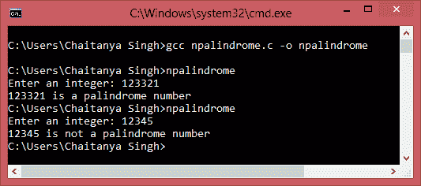
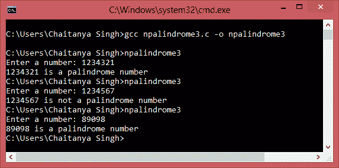

# C 程序：检查数字是否为回文数

> 原文： [https://beginnersbook.com/2015/02/c-program-to-check-if-a-number-is-palindrome-or-not/](https://beginnersbook.com/2015/02/c-program-to-check-if-a-number-is-palindrome-or-not/)

如果数字保持不变，即使我们反转其数字，该数字也称为回文数。例如，12321 是回文数，因为如果我们反转它的数字它仍然是相同的。在本文中，我们共享了两个 C 程序来检查输入数字是否为回文数据。 1）使用`while`循环 2）使用递归。

#### 程序 1：使用`while`循环检查回文

```c
/* Program to check if a number is palindrome or not
 * using while loop
 */

#include <stdio.h>
int main()
{
   int num, reverse_num=0, remainder,temp;
   printf("Enter an integer: ");
   scanf("%d", &num);

   /* Here we are generating a new number (reverse_num)
    * by reversing the digits of original input number
    */
   temp=num;
   while(temp!=0)
   {
      remainder=temp%10;
      reverse_num=reverse_num*10+remainder;
      temp/=10;
   } 

   /* If the original input number (num) is equal to
    * to its reverse (reverse_num) then its palindrome
    * else it is not.
    */ 
   if(reverse_num==num) 
      printf("%d is a palindrome number",num);
   else
      printf("%d is not a palindrome number",num);
   return 0;
}
```

**输出：**


#### 程序 2：使用递归检查回文

```c
#include<stdio.h>

int check_palindrome(int num){

   static int reverse_num=0,rem;

   if(num!=0){
      rem=num%10;
      reverse_num=reverse_num*10+rem;
      check_palindrome(num/10);
   }

   return reverse_num;
}
int main(){
   int num, reverse_num;

   printf("Enter a number: ");
   scanf("%d",&num);

   reverse_num = check_palindrome(num);

   if(num==reverse_num)
      printf("%d is a palindrome number",num);
   else
      printf("%d is not a palindrome number",num);

   return 0;
}

```

**输出：**
