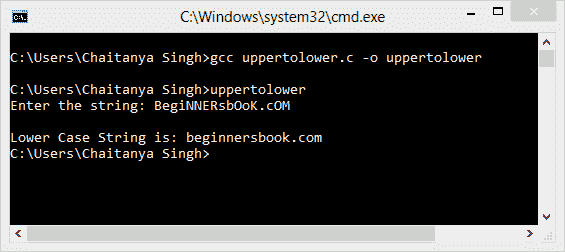

# C 程序：将大写字符串转换为小写字符串

> 原文： [https://beginnersbook.com/2015/02/c-program-to-convert-uppercase-string-to-lowercase-string/](https://beginnersbook.com/2015/02/c-program-to-convert-uppercase-string-to-lowercase-string/)

在下面的 C 程序中，将要求用户输入一个字符串（它可以是完整的大写或部分大写），然后程序会将其转换为完整的（小写的所有字符）小写字符串。我们在以下程序中使用的逻辑是：所有大写字符（A-Z）的 ASCII 值范围为 65 到 90，它们对应的小写字符（a-z）的 ASCII 值大于它们的 32。例如' **A** '的 ASCII 值为 65，' **a** '的 ASCII 值为 97（65 + 32）。同样适用于其他角色。

```

/* C program to convert uppercase string to
 * lower case
 * written by: Chaitanya
 */
#include<stdio.h>
#include<string.h>
int main(){
   /* This array can hold a string of upto 25
    * chars, if you are going to enter larger string
    * then increase the array size accordingly
    */
   char str[25];
   int i;
   printf("Enter the string: ");
   scanf("%s",str);

   for(i=0;i<=strlen(str);i++){
      if(str[i]>=65&&str[i]<=90)
         str[i]=str[i]+32;
   }
   printf("\nLower Case String is: %s",str);
   return 0;
}
```

**输出：**


正如你在输出中看到的那样，我们输入了一个部分（只有少数字符大写）大写字符串，程序输出是一个完整的小写字符串。