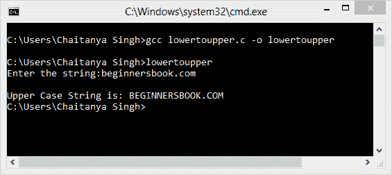

# C 将小写字符串转换为大写字符串的程序

> 原文： [https://beginnersbook.com/2015/02/c-program-to-convert-lowercase-string-to-uppercase-string/](https://beginnersbook.com/2015/02/c-program-to-convert-lowercase-string-to-uppercase-string/)

在以下程序中，将要求用户输入小写字符串，程序将其转换为大写字符串。程序中遵循的逻辑：所有小写字符（a 到 z）的 ASCII 值范围从 97 到 122，它们对应的大写字符（A 到 Z）的 ASCII 值比它们小 32。例如，'a'具有 ASCII 值 97，'A'具有 ASCII 值 65（97-32）。其他字母同样适用。基于这个逻辑，我们编写了以下 C 程序进行转换。

#### C 程序 - 将 String 从小写转换为大写

```

/* C Program to convert Lower case
 * String to Upper case.
 * Written by: Chaitanya
 */

#include<stdio.h>
#include<string.h>
int main(){
   char str[25];
   int i;

   printf("Enter the string:");
   scanf("%s",str);

   for(i=0;i<=strlen(str);i++){
      if(str[i]>=97&&str[i]<=122)
         str[i]=str[i]-32;
   }
   printf("\nUpper Case String is: %s",str);
   return 0;
}
```

**输出：**


正如您在上面的截图中所观察到的，我们输入了一个小写字符串（beginnersbook.com）并将程序转换为大写字符串（BEGINNERSBOOK.COM）