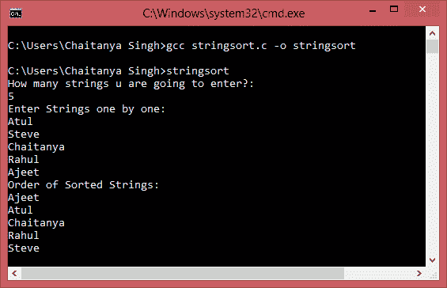

# C 程序：按字母顺序对字符串集进行排序

> 原文： [https://beginnersbook.com/2015/02/c-program-to-sort-set-of-strings-in-alphabetical-order/](https://beginnersbook.com/2015/02/c-program-to-sort-set-of-strings-in-alphabetical-order/)

在以下程序中，将要求用户输入一组字符串，程序将按字母顺序升序排序并显示它们。

#### C 程序 - 按升序字母顺序对一组字符串进行排序

```c
/* This program would sort the input strings in
 * an ascending order and would display the same
 */
#include<stdio.h>
#include<string.h>
int main(){
   int i,j,count;
   char str[25][25],temp[25];
   puts("How many strings u are going to enter?: ");
   scanf("%d",&count);

   puts("Enter Strings one by one: ");
   for(i=0;i<=count;i++)
      gets(str[i]);
   for(i=0;i<=count;i++)
      for(j=i+1;j<=count;j++){
         if(strcmp(str[i],str[j])>0){
            strcpy(temp,str[i]);
            strcpy(str[i],str[j]);
            strcpy(str[j],temp);
         }
      }
   printf("Order of Sorted Strings:");
   for(i=0;i<=count;i++)
      puts(str[i]);

   return 0;
}
```

**输出：**


正如你在上面的输出屏幕截图中观察到的那样，我们输入了 5 个字符串，程序然后按升序对它们进行排序。我们得到一组有序的字符串作为输出。