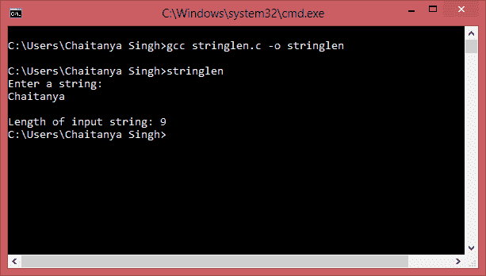

# C 程序：在不使用函数`strlen()`的情况下查找字符串的长度

> 原文： [https://beginnersbook.com/2015/02/c-program-to-find-the-length-of-a-string/](https://beginnersbook.com/2015/02/c-program-to-find-the-length-of-a-string/)

在下面的 C 程序中，我们计算给定 String 中的字符数，以找出并在控制台上显示其长度。在执行该程序时，将要求用户输入字符串，然后程序将对字符进行计数并将输出字符串的长度显示为输出。

#### C 程序 - 在不使用标准库函数`strlen`的情况下查找字符串的长度

```c
/* C Program to find the length of a String without
 *  using any standard library function 
 */
#include <stdio.h>
int main()
{
    /* Here we are taking a char array of size 
     * 100 which means this array can hold a string 
     * of 100 chars. You can change this as per requirement
     */
    char str[100],i;
    printf("Enter a string: \n");
    scanf("%s",str);

    // '\0' represents end of String
    for(i=0; str[i]!='\0'; ++i);
       printf("\nLength of input string: %d",i);

    return 0;
}

```

**输出：**

