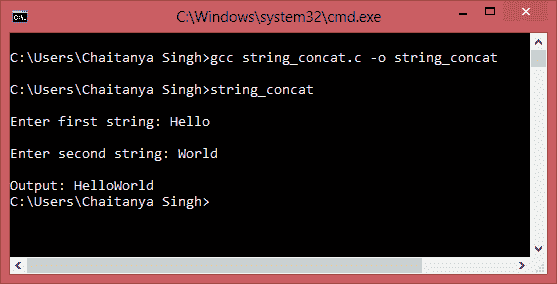

# C 程序：在不使用`strcat`的情况下连接两个字符串

> 原文： [https://beginnersbook.com/2015/02/c-program-to-concatenate-two-strings-without-using-strcat/](https://beginnersbook.com/2015/02/c-program-to-concatenate-two-strings-without-using-strcat/)

在下面的程序中，将要求用户输入两个字符串，然后程序将它们连接起来。对于连接，我们没有使用标准库函数`strcat()`，而是编写了一个逻辑来在第一个字符串的末尾附加第二个字符串。

#### 用于字符串连接的 C 程序

```c
/* C program to concatenate two strings without
 * using standard library function strcat()
 */
#include <stdio.h>
int main()
{
   char str1[50], str2[50], i, j;
   printf("\nEnter first string: ");
   scanf("%s",str1);
   printf("\nEnter second string: ");
   scanf("%s",str2);
   /* This loop is to store the length of str1 in i
    * It just counts the number of characters in str1
    * You can also use strlen instead of this.
    */
   for(i=0; str1[i]!='\0'; ++i); 

   /* This loop would concatenate the string str2 at
    * the end of str1
    */
   for(j=0; str2[j]!='\0'; ++j, ++i)
   {
      str1[i]=str2[j];
   }
   // \0 represents end of string
   str1[i]='\0';
   printf("\nOutput: %s",str1);

   return 0;
}
```

**输出：**

正如您所看到的，我们已经输入了两个字符串，并且在程序的输出中两个字符串都被连接起来。