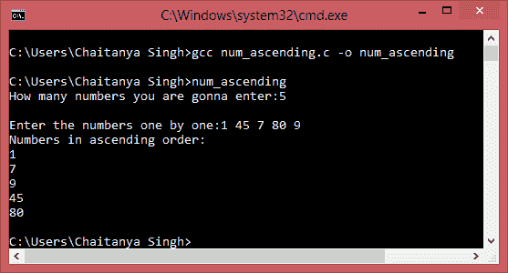

# C 程序按升序排列数字

> 原文： [https://beginnersbook.com/2015/02/c-program-to-arrange-numbers-in-ascending-order/](https://beginnersbook.com/2015/02/c-program-to-arrange-numbers-in-ascending-order/)

以下程序提示用户输入 n 个数字，一旦用户输入这些数字，该程序将按升序排序并显示它们。这里我们为分类目的创建了一个用户定义的函数 sort_numbers_ascending（）。

```
/*
 * C program to accept numbers as an input from user
 * and to sort them in ascending order.
 */
#include <stdio.h>

void sort_numbers_ascending(int number[], int count)
{
   int temp, i, j, k;
   for (j = 0; j < count; ++j)
   {
      for (k = j + 1; k < count; ++k)
      {
         if (number[j] > number[k])
         {
            temp = number[j];
            number[j] = number[k];
            number[k] = temp;
         }
      }
   }
   printf("Numbers in ascending order:\n");
   for (i = 0; i < count; ++i)
      printf("%d\n", number[i]);
}
void main()
{
   int i, count, number[20];

   printf("How many numbers you are gonna enter:");
   scanf("%d", &count);
   printf("\nEnter the numbers one by one:");

   for (i = 0; i < count; ++i)
      scanf("%d", &number[i]);

   sort_numbers_ascending(number, count);
}
```

输出：

