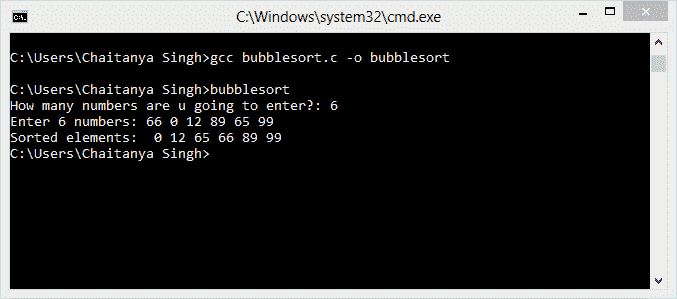

# C 泡泡分拣程序

> 原文： [https://beginnersbook.com/2015/02/c-program-for-bubble-sorting/](https://beginnersbook.com/2015/02/c-program-for-bubble-sorting/)

冒泡排序也称为下沉排序。该算法比较每对相邻项目，如果它们的顺序错误则交换它们，并且同样的过程继续进行，直到不需要交换。在下面的程序中，我们使用 C 语言实现冒泡排序。在该程序中，将要求用户输入元素的数量以及元素值，然后程序将使用气泡排序算法逻辑按升序对它们进行排序。

#### 在 C 程序中实现冒泡排序算法

```
/* Implementing Bubble sort in a C Program
 * Written by: Chaitanya. 
 */
#include<stdio.h>

int main(){

   int count, temp, i, j, number[30];

   printf("How many numbers are u going to enter?: ");
   scanf("%d",&count);

   printf("Enter %d numbers: ",count);

   for(i=0;i<count;i++)
   scanf("%d",&number[i]);

   /* This is the main logic of bubble sort algorithm 
    */
   for(i=count-2;i>=0;i--){
      for(j=0;j<=i;j++){
        if(number[j]>number[j+1]){
           temp=number[j];
           number[j]=number[j+1];
           number[j+1]=temp;
        }
      }
   }

   printf("Sorted elements: ");
   for(i=0;i<count;i++)
      printf(" %d",number[i]);

   return 0;
}
```

**输出：**

