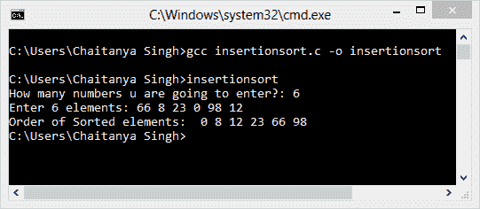

# C 中的插入排序程序

> 原文： [https://beginnersbook.com/2015/02/insertion-sort-program-in-c/](https://beginnersbook.com/2015/02/insertion-sort-program-in-c/)

插入排序算法逐个选择元素，并将其放置在元素排序列表中的所在位置。在下面的 C 程序中，我们实现了相同的逻辑。

在完成程序之前，让我们看一下示例帮助下的插入排序步骤。
输入元素：89 17 8 12 0
步骤 1： **89** 17 8 12 0（粗体元素是排序列表和非粗体未排序列表）
第 2 步： **17 89** 8 12 0（每个元素将从未排序列表中删除并放置在排序列表中的正确位置）
步骤 3： **8 17 89** 12 0
步骤 4： **8 12 17 89** 0
步骤 5： **0 8 12 17 89**

#### C 程序 - 插入排序实现

```
#include<stdio.h>
int main(){

   /* Here i & j for loop counters, temp for swapping,
    * count for total number of elements, number[] to
    * store the input numbers in array. You can increase
    * or decrease the size of number array as per requirement
    */
   int i, j, count, temp, number[25];

   printf("How many numbers u are going to enter?: ");
   scanf("%d",&count);

   printf("Enter %d elements: ", count);
   // This loop would store the input numbers in array
   for(i=0;i<count;i++)
      scanf("%d",&number[i]);

   // Implementation of insertion sort algorithm
   for(i=1;i<count;i++){
      temp=number[i];
      j=i-1;
      while((temp<number[j])&&(j>=0)){
         number[j+1]=number[j];
         j=j-1;
      }
      number[j+1]=temp;
   }

   printf("Order of Sorted elements: ");
   for(i=0;i<count;i++)
      printf(" %d",number[i]);

   return 0;
}
```

**输出：**


正如您可以在输出中观察到的那样，我们以随机顺序输入了 6 个整数，并且上面的 C 程序通过使用插入排序算法的逻辑以升序对它们进行排序。