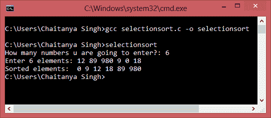

# C 中的选择排序程序

> 原文： [https://beginnersbook.com/2015/02/selection-sort-program-in-c/](https://beginnersbook.com/2015/02/selection-sort-program-in-c/)

在 Selection sort 中，最小元素与未排序元素列表的第一个元素交换（交换元素占用最初放置最小元素的位置）。然后，第二个最小元素与未排序元素列表的第二个元素交换，依此类推，直到所有元素都被排序。在下面的 C 程序中，我们实现了相同的逻辑。

在完成程序之前，让我们通过一个例子来看看选择排序的步骤：
输入的元素：22 0 -90 89 17
步骤 1：-90 0 22 89 17（22 和-90 交换位置）
步骤 2：-90 0 22 89 17（0 在正确位置，无需交换）
步骤 3：-90 0 17 89 22（22 和 17 交换位置）
步骤 4： -90 0 17 22 89（89 和 22 交换位置）

#### C 程序 - 选择排序

```
#include<stdio.h>
int main(){
   /* Here i & j for loop counters, temp for swapping,
    * count for total number of elements, number[] to
    * store the input numbers in array. You can increase
    * or decrease the size of number array as per requirement
    */
   int i, j, count, temp, number[25];

   printf("How many numbers u are going to enter?: ");
   scanf("%d",&count);

   printf("Enter %d elements: ", count);
   // Loop to get the elements stored in array
   for(i=0;i<count;i++)
      scanf("%d",&number[i]);

   // Logic of selection sort algorithm
   for(i=0;i<count;i++){
      for(j=i+1;j<count;j++){
         if(number[i]>number[j]){
            temp=number[i];
            number[i]=number[j];
            number[j]=temp;
         }
      }
   }

   printf("Sorted elements: ");
   for(i=0;i<count;i++)
      printf(" %d",number[i]);

   return 0;
}
```

**输出：**


正如您所看到的，我们已经按随机顺序输入了 6 个元素，程序通过使用我们在程序中实现的选择排序算法按升序对它们进行排序。您还可以修改此相同的程序，以按降序对元素进行排序。