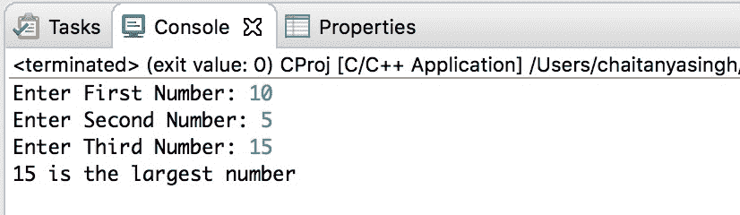

# C 程序：使用指针查找最大的三个数字

> 原文： [https://beginnersbook.com/2019/02/c-program-to-find-the-largest-of-three-numbers-using-pointers/](https://beginnersbook.com/2019/02/c-program-to-find-the-largest-of-three-numbers-using-pointers/)

在本教程中，我们将编写一个 C 程序，使用指针查找三个输入数字中最大的一个。

## 使用指针查找最大数字的程序

在下面的程序中，我们有三个整数`num1`，`num2`，`num3`。我们已将这三个数字的地址分别分配给三个指针`p1`，`p2`，`p3`。之后我们使用[`if else`语句](https://beginnersbook.com/2014/01/c-if-statement/)对存储在指针指向的地址处的值进行了比较。

```c
#include <stdio.h>
int main()
{
    int num1, num2, num3;
    int *p1, *p2, *p3;

    //taking input from user
    printf("Enter First Number: ");
    scanf("%d",&num1);
    printf("Enter Second Number: ");
    scanf("%d",&num2);
    printf("Enter Third Number: ");
    scanf("%d",&num3);

    //assigning the address of input numbers to pointers
    p1 = &num1;
    p2 = &num2;
    p3 = &num3;
    if(*p1 > *p2)
    {
	if(*p1 > *p3)
	{
		printf("%d is the largest number", *p1);
	}
	else
	{
		printf("%d is the largest number", *p3);
	}
    }
    else
    {
	if(*p2 > *p3)
	{
		printf("%d is the largest number", *p2);
	}
	else
	{
		printf("%d is the largest number", *p3);
	}
    }
    return 0;
}
```

**输出：**


#### 相关 C 示例

1\. [C 程序使用指针来计算字符串中的元音和辅音](https://beginnersbook.com/2019/02/c-program-to-count-vowels-and-consonants-in-a-string-using-pointer/)
2\. [C 程序使用指针打印字符串](https://beginnersbook.com/2019/02/c-program-to-print-string-using-pointer/)
3\. [C 程序到使用指针交换两个数字](https://beginnersbook.com/2019/02/c-program-to-swap-two-numbers-using-pointers/)
4\. [C 程序创建初始化并访问指针变量](https://beginnersbook.com/2019/02/c-program-to-create-initialize-and-access-a-pointer-variable/)
5\. [C 程序找到最大的三个数字而不使用指针](https://beginnersbook.com/2014/06/c-program-to-find-greatest-of-three-numbers/)