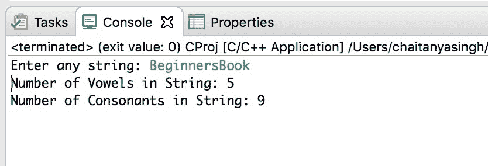

# C 程序：使用指针计算字符串中的元音和辅音

> 原文： [https://beginnersbook.com/2019/02/c-program-to-count-vowels-and-consonants-in-a-string-using-pointer/](https://beginnersbook.com/2019/02/c-program-to-count-vowels-and-consonants-in-a-string-using-pointer/)

在本教程中，我们将编写一个 C 程序，使用 Pointer 计算给定 String 中的元音和辅音。

要了解这个程序，你应该知道[数组](https://beginnersbook.com/2014/01/c-arrays-example/)和[指针在 C](https://beginnersbook.com/2014/01/c-pointers/) 中的基础知识。

## 使用指针计算字符串中的元音和辅音的程序

在下面的程序中，我们声明了一个 char 数组`str`来保存我们使用`fgets()`函数存储在数组中的输入字符串。我们已经将数组的基址（第一个元素的地址）分配给指针`p`。我们使用[内部的指针 p 循环浏览输入字符串的所有字符，同时循环](https://beginnersbook.com/2014/01/c-while-loop/)并在每次迭代时递增指针值。

```
#include <stdio.h>
int main()
{
    char str[100];
    char *p;
    int  vCount=0,cCount=0;

    printf("Enter any string: ");
    fgets(str, 100, stdin);

    //assign base address of char array to pointer
    p=str;

    //'\0' signifies end of the string
    while(*p!='\0')
    {
        if(*p=='A' ||*p=='E' ||*p=='I' ||*p=='O' ||*p=='U'
        		||*p=='a' ||*p=='e' ||*p=='i' ||*p=='o' ||*p=='u')
            vCount++;
        else
            cCount++;
        //increase the pointer, to point next character
        p++;
    }

    printf("Number of Vowels in String: %d\n",vCount);
    printf("Number of Consonants in String: %d",cCount);
    return 0;
}

```

**输出：**


#### 相关 C 示例

1\. [C 程序使用指针打印字符串](https://beginnersbook.com/2019/02/c-program-to-print-string-using-pointer/)
2\. [C 程序用指针交换两个数字](https://beginnersbook.com/2019/02/c-program-to-swap-two-numbers-using-pointers/)
3\. [C 程序创建初始化和访问指针变量](https://beginnersbook.com/2019/02/c-program-to-create-initialize-and-access-a-pointer-variable/)