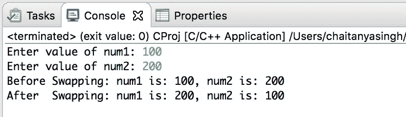

# C 程序：使用指针交换两个数字

> 原文： [https://beginnersbook.com/2019/02/c-program-to-swap-two-numbers-using-pointers/](https://beginnersbook.com/2019/02/c-program-to-swap-two-numbers-using-pointers/)

在本教程中，我们将编写一个 C 程序，使用指针交换两个数字。我们已经涵盖[如何在不使用指针](https://beginnersbook.com/2017/09/c-program-to-swap-two-numbers/)的情况下交换两个数字。

## C 使用指针交换两个数字的示例

```c
/*C program by Chaitanya for beginnersbook.com
 * Program to swap two numbers using pointers*/
#include <stdio.h>

// function to swap the two numbers
void swap(int *x,int *y)
{
    int t;
     t   = *x;
    *x   = *y;
    *y   =  t;
}

int main()
{
    int num1,num2;

    printf("Enter value of num1: ");
    scanf("%d",&num1);
    printf("Enter value of num2: ");
    scanf("%d",&num2);

    //displaying numbers before swapping
    printf("Before Swapping: num1 is: %d, num2 is: %d\n",num1,num2);

    //calling the user defined function swap()
    swap(&num1,&num2);

    //displaying numbers after swapping
    printf("After  Swapping: num1 is: %d, num2 is: %d\n",num1,num2);

    return 0;
}
```

**输出：**


#### 相关 C 示例

1\. [C 程序：声明，初始化和访问指针](https://beginnersbook.com/2019/02/c-program-to-create-initialize-and-access-a-pointer-variable/)
2\. [C 程序：检查`char`是否为字母](https://beginnersbook.com/2017/09/c-program-to-check-whether-a-character-is-an-alphabet-or-not/)
3\. [C 程序：将十进制转换为八进制](https://beginnersbook.com/2017/09/c-program-to-convert-decimal-to-octal-number/)
4\. [C 程序：查找商和余数](https://beginnersbook.com/2017/09/c-program-to-find-quotient-and-remainder/)