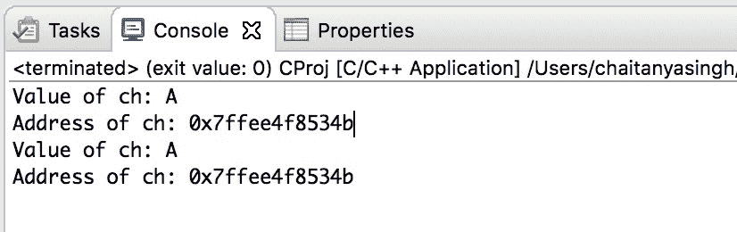

# C 程序：创建，初始化和访问指针变量

> 原文： [https://beginnersbook.com/2019/02/c-program-to-create-initialize-and-access-a-pointer-variable/](https://beginnersbook.com/2019/02/c-program-to-create-initialize-and-access-a-pointer-variable/)

在本教程中，我们将编写一个 C 程序来创建，初始化和访问指针变量。要学习指针的基础知识，请参阅我的教程： [C 指针](https://beginnersbook.com/2014/01/c-pointers/)

## 示例：用于创建，访问和初始化指针的程序

在下面的程序中，我们声明了一个字符变量`ch`和字符指针`pCh`，之后我们用 `char ch`的地址值初始化了指针变量`pCh`。
该示例还说明了如何使用指针变量`pCh`访问`ch`的值和地址

```c
/* Created by Chaitanya for Beginnersbook.com
 * C program to create, initialize and access a pointer
 */

#include <stdio.h>

int main()
{
	//char variable
    char ch;

    //char pointer
    char *pCh;

    /* Initializing pointer variable with the
     * address of variable ch
     */
    pCh = &ch;

    //Assigning value to the variable ch
    ch = 'A';

    //access value and address of ch using variable ch
    printf("Value of ch: %c\n",ch);
    printf("Address of ch: %p\n",&ch);

    //access value and address of ch using pointer variable pCh
    printf("Value of ch: %c\n",*pCh);
    printf("Address of ch: %p",pCh);

   return 0;
}
```

**输出：**


#### 相关 C 示例

1\. [C 程序检查闰年](https://beginnersbook.com/2017/09/c-program-to-check-leap-year/)
2\. [C 程序交换两个数字](https://beginnersbook.com/2017/09/c-program-to-swap-two-numbers/)
3\. [C 程序找到`int`，`float`，`double`和`char`的大小](https://beginnersbook.com/2017/09/c-program-to-find-the-size-of-int-float-double-and-char/)
4\. [C 程序查找字符的 ASCII 值](https://beginnersbook.com/2017/09/c-program-to-find-ascii-value-of-a-character/)