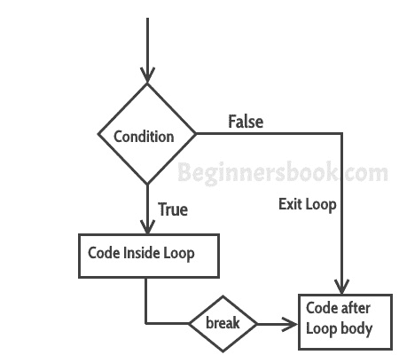

# C 编程中的`break`语句

> 原文： [https://beginnersbook.com/2014/01/c-break-statement/](https://beginnersbook.com/2014/01/c-break-statement/)

`break`语句用于循环内部和[`switch case`](https://beginnersbook.com/2014/01/switch-case-statements-in-c/) 。

## C - `break`语句

它用于立即退出循环。当在循环内遇到`break`语句时，控制流直接退出循环并且循环终止。它与[`if`语句](https://beginnersbook.com/2014/01/c-if-statement/)一起使用，只要在循环内使用。

这也可用于`switch-case`控制结构。每当在`switch-case`中遇到它时，控制器都会从`switch-case`中出来（参见下面的例子）。

### `break`语句的流程图



语法：

```c
break;
```

### 示例 - 在`while`循环中使用`break`

```c
#include <stdio.h>
int main()
{
     int num =0;
     while(num<=100)
     {
        printf("value of variable num is: %d\n", num);
        if (num==2)
        {
            break;
        }
        num++;
     }
     printf("Out of while-loop");
     return 0;
}
```

**输出：**

```c
value of variable num is: 0
value of variable num is: 1
value of variable num is: 2
Out of while-loop
```

### 示例 - 在`for`循环中使用`break`

```c
#include <stdio.h>
int main()
{
      int var;
      for (var =100; var>=10; var --)
      {
           printf("var: %d\n", var);
           if (var==99)
           {
               break;
           }
      }
     printf("Out of for-loop");
     return 0;
}

```

**Output:**

```c
var: 100
var: 99
Out of for-loop
```

### 示例 - 在`switch-case`中使用`break`语句

```c
#include <stdio.h>
int main()
{
      int num;
      printf("Enter value of num:");
      scanf("%d",&num);
      switch (num)
      {
          case 1:
             printf("You have entered value 1\n");
             break;
          case 2:
             printf("You have entered value 2\n");
             break;
          case 3:
             printf("You have entered value 3\n");
             break;
          default:
             printf("Input value is other than 1,2 & 3 ");
     }
     return 0;
}
```

输出：

```c
Enter value of num:2
You have entered value 2
```

您总是希望在`switch case`块中使用`break`语句，否则一旦执行了`case`块，其余的后续 case 块就会执行。例如，如果我们不在每个`case`块之后使用`break`语句，那么这个程序的输出将是：

```c
Enter value of num:2
You have entered value 2
You have entered value 3
Input value is other than 1,2 & 3
```