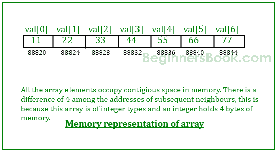

# C 编程中的指针和数组示例

> 原文： [https://beginnersbook.com/2014/01/c-pointer-to-array-example/](https://beginnersbook.com/2014/01/c-pointer-to-array-example/)

在本指南中，我们将学习如何在 C 程序中使用指针和数组。我建议你在阅读本指南之前参考[数组](https://beginnersbook.com/2014/01/c-arrays-example/)和[指针](https://beginnersbook.com/2014/01/c-pointers/)教程，这样你就可以很容易地理解这里解释的概念了。

## 打印数组元素地址的简单示例

```c
#include <stdio.h>
int main( )
{
   int val[7] = { 11, 22, 33, 44, 55, 66, 77 } ;
   /* for loop to print value and address of each element of array*/
   for ( int i = 0 ; i < 7 ; i++ )
   {
      /* The correct way of displaying the address would be using %p format
       * specifier like this:
       * printf("val[%d]: value is %d and address is %p\n", i, val[i], &val[i]);
       * Just to demonstrate that the array elements are stored in contiguous
       * locations, I m displaying the addresses in integer
       */
      printf("val[%d]: value is %d and address is %d\n", i, val[i], &val[i]);
   }
   return 0;
}
```

**输出：**

```c
val[0]: value is 11 and address is 1423453232
val[1]: value is 22 and address is 1423453236
val[2]: value is 33 and address is 1423453240
val[3]: value is 44 and address is 1423453244
val[4]: value is 55 and address is 1423453248
val[5]: value is 66 and address is 1423453252
val[6]: value is 77 and address is 1423453256

```

> 请注意，每个元素之间存在 4 个字节的差异，因为这是整数的大小。这意味着所有元素都存储在内存中连续的连续内存位置。（参见下图）



在上面的例子中，我使用&amp; val [i]来获取数组的第 i 个元素的地址。我们也可以使用指针变量而不是使用&符号（&amp;）来获取地址。

## 示例 - C 中的数组和指针示例

```c
#include <stdio.h>
int main( )
{
   /*Pointer variable*/
   int *p;

   /*Array declaration*/
   int val[7] = { 11, 22, 33, 44, 55, 66, 77 } ;

   /* Assigning the address of val[0] the pointer
    * You can also write like this:
    * p = var;
    * because array name represents the address of the first element
    */
   p = &val[0];

   for ( int i = 0 ; i<7 ; i++ )
   {
      printf("val[%d]: value is %d and address is %p\n", i, *p, p);
      /* Incrementing the pointer so that it points to next element
       * on every increment.
       */
      p++;
   }
   return 0;
}

```

输出：

```c
val[0]: value is 11 and address is 0x7fff51472c30
val[1]: value is 22 and address is 0x7fff51472c34
val[2]: value is 33 and address is 0x7fff51472c38
val[3]: value is 44 and address is 0x7fff51472c3c
val[4]: value is 55 and address is 0x7fff51472c40
val[5]: value is 66 and address is 0x7fff51472c44
val[6]: value is 77 and address is 0x7fff51472c48
```

**注意事项：**
1）使用带数组的指针时，指针的数据类型必须与数组的数据类型匹配。
2）你也可以使用数组名来初始化指针，如下所示：

```c
p = var;
```

因为数组名称本身就等于数组的基址。

```c
val==&val[0];
```

3）在循环中，对指针变量执行递增操作（p ++）以获取下一个位置（下一个元素的位置），此算法对于所有类型的数组都是相同的（对于所有数据类型 double，char，int 等）即使每种数据类型消耗的字节不同。

**指针逻辑**
你必须已经理解了上面代码中的逻辑，所以现在是时候玩几个指针算术和表达式了。

```c
if p = &val[0] which means
*p ==val[0]
(p+1) == &val[2]  & *(p+1) == val[2]
(p+2) == &val[3]  & *(p+2) == val[3]
(p+n) == &val[n+1) & *(p+n) == val[n+1]
```

使用这个逻辑，我们可以用更好的方式重写我们的代码：

```c
#include <stdio.h>
int main( )
{
   int *p;
   int val[7] = { 11, 22, 33, 44, 55, 66, 77 } ;
   p = val;
   for ( int i = 0 ; i<7 ; i++ )
   {
      printf("val[%d]: value is %d and address is %p\n", i, *(p+i), (p+i));
   }
   return 0;
}

```

我们在这个程序中不需要 p ++语句。