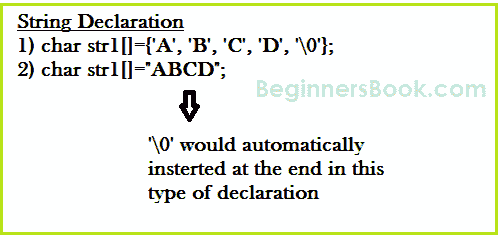
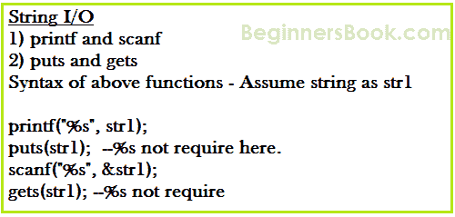
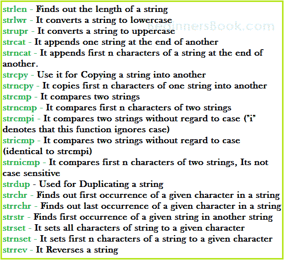

# C - 字符串和字符串函数

> 原文： [https://beginnersbook.com/2014/01/c-strings-string-functions/](https://beginnersbook.com/2014/01/c-strings-string-functions/)

**String 是一个字符数组**。在本指南中，我们将学习如何声明字符串，如何在 C 编程中使用字符串以及如何使用预定义的字符串处理函数。

我们将看到如何比较两个字符串，连接字符串，将一个字符串复制到另一个字符串&amp;执行各种字符串操作操作。我们可以使用“string.h”头文件的预定义函数执行此类操作。要使用这些字符串函数，必须在 C 程序中包含 string.h 文件。

## 字符串声明


**方法 1：**

```c
char address[]={'T', 'E', 'X', 'A', 'S', '\0'};
```

**方法 2：上面的字符串也可以定义为** -

```c
char address[]="TEXAS";
```

在上面的声明中，NULL 字符（\ 0）将自动插入字符串的末尾。

**什么是 NULL Char“\ 0”？**
`'\0'`表示字符串的结尾。它也被称为 String 终结器&amp;空字符。

## C 编程中的字符串 I/O.



### 使用`printf()`和`scanf()`函数在 C 中读取和编写字符串

```c
#include <stdio.h>
#include <string.h>
int main()
{
    /* String Declaration*/
    char nickname[20];

    printf("Enter your Nick name:");

    /* I am reading the input string and storing it in nickname
     * Array name alone works as a base address of array so
     * we can use nickname instead of &nickname here
     */
    scanf("%s", nickname);

    /*Displaying String*/
    printf("%s",nickname);

    return 0;
}

```

输出：

```c
Enter your Nick name:Negan
Negan
```

**注意：**％s 格式说明符用于字符串输入/输出

### 使用`gets()`和`puts()`函数在 C 中读取和编写字符串

```c
#include <stdio.h>
#include <string.h>
int main()
{
    /* String Declaration*/
    char nickname[20];

    /* Console display using puts */
    puts("Enter your Nick name:");

    /*Input using gets*/
    gets(nickname);

    puts(nickname);

    return 0;
}
```

## C - 字符串函数



### C 字符串函数 - `strlen`

句法：

```c
size_t strlen(const char *str)
```

**size_t** 表示无符号短
它返回字符串的长度而不包括结束字符**（终止字符'\ 0'）**。

**strlen 的例子：**

```c
#include <stdio.h>
#include <string.h>
int main()
{
     char str1[20] = "BeginnersBook";
     printf("Length of string str1: %d", strlen(str1));
     return 0;
}
```

Output:

```c
Length of string str1: 13
```

**strlen vs sizeof**
strlen 返回存储在数组中的字符串的长度，但 sizeof 返回分配给数组的总分配大小。因此，如果我再次考虑上述示例，则以下语句将返回以下值。

`strlen(str1)`返回值 13\.
`sizeof(str1)`将返回值 20，因为数组大小为 20（请参阅 main 函数中的第一个语句）。

### C 字符串函数 - `strnlen`

Syntax:

```c
size_t strnlen(const char *str, size_t maxlen)
```

size_t 表示无符号短
如果字符串小于为 maxlen 指定的值（最大长度），则返回字符串的长度，否则返回 maxlen 值。

**strnlen 的例子：**

```c
#include <stdio.h>
#include <string.h>
int main()
{
     char str1[20] = "BeginnersBook";
     printf("Length of string str1 when maxlen is 30: %d", strnlen(str1, 30));
     printf("Length of string str1 when maxlen is 10: %d", strnlen(str1, 10));
     return 0;
}
```

输出：
当 maxlen 为 30：13 时字符串 str1 的长度
当 maxlen 为 10:10 时字符串 str1 的长度

您是否注意到第二个 printf 语句的输出，即使字符串长度为 13，它只返回 10，因为 maxlen 为 10。

### C 字符串函数 - `strcmp`

```c
int strcmp(const char *str1, const char *str2)
```

它比较两个字符串并返回一个整数值。如果两个字符串相同（相等），则此函数将返回 0，否则它可能会根据比较返回负值或正值。

**如果 string1&lt; string2 OR string1 是 string2** 的子字符串，然后它会产生负值。如果 string1&gt; string2 然后它将返回正值。
**如果 string1 == string2** ，那么当你将此函数用于比较字符串时，你会得到 0（零）。

**strcmp 示例：**

```c
#include <stdio.h>
#include <string.h>
int main()
{
     char s1[20] = "BeginnersBook";
     char s2[20] = "BeginnersBook.COM";
     if (strcmp(s1, s2) ==0)
     {
        printf("string 1 and string 2 are equal");
     }else
      {
         printf("string 1 and 2 are different");
      }
     return 0;
}
```

**输出：**

```c
string 1 and 2 are different
```

### C 字符串函数 - `strncmp`

```c
int strncmp(const char *str1, const char *str2, size_t n)
```

size_t 用于未分配的短
它比较字符串直到 n 个字符，或者换句话说，它比较两个字符串的前 n 个字符。

**strncmp 示例：**

```c
#include <stdio.h>
#include <string.h>
int main()
{
     char s1[20] = "BeginnersBook";
     char s2[20] = "BeginnersBook.COM";
     /* below it is comparing first 8 characters of s1 and s2*/
     if (strncmp(s1, s2, 8) ==0)
     {
         printf("string 1 and string 2 are equal");
     }else
     {
         printf("string 1 and 2 are different");
     }
     return 0;
}
```

**Output:**

```c
string1 and string 2 are equal
```

### C 字符串函数 - `strcat`

```c
char *strcat(char *str1, char *str2)
```

它连接两个字符串并返回连接的字符串。

**strcat 示例：**

```c
#include <stdio.h>
#include <string.h>
int main()
{
     char s1[10] = "Hello";
     char s2[10] = "World";
     strcat(s1,s2);
     printf("Output string after concatenation: %s", s1);
     return 0;
}
```

**Output:**

```c
Output string after concatenation: HelloWorld
```

### C 字符串函数 - `strncat`

```c
char *strncat(char *str1, char *str2, int n)
```

它将 str2 的 n 个字符连接到字符串 str1。终结符 char（'\ 0'）将始终附加在连接字符串的末尾。

**strncat 示例：**

```c
#include <stdio.h>
#include <string.h>
int main()
{
     char s1[10] = "Hello";
     char s2[10] = "World";
     strncat(s1,s2, 3);
     printf("Concatenation using strncat: %s", s1);
     return 0;
}
```

**Output:**

```c
Concatenation using strncat: HelloWor
```

### C 字符串函数 - `strcpy`

```c
char *strcpy( char *str1, char *str2)
```

它将字符串 str2 复制到字符串 str1 中，包括结束字符（终结符 char'\ 0'）。

**strcpy 示例：**

```c
#include <stdio.h>
#include <string.h>
int main()
{
     char s1[30] = "string 1";
     char s2[30] = "string 2 : I’m gonna copied into s1";
     /* this function has copied s2 into s1*/
     strcpy(s1,s2);
     printf("String s1 is: %s", s1);
     return 0;
}
```

**Output:**

```c
String s1 is: string 2: I’m gonna copied into s1
```

### C 字符串函数 - `strncpy`

char * strncpy（char * str1，char * str2，size_t n）
size_t 是未分配的 short，n 是数字。
**情况 1：**如果 str2 的长度&gt;然后它只是将 str2 的前 n 个字符复制到 str1 中。
**情况 2：**如果 str2 的长度&lt;1。然后它将 str2 的所有字符复制到 str1 中，并附加几个终结符字符（'\ 0'）以累积 str1 的长度使其成为 n。

**strncpy 的例子：**

```c
#include <stdio.h>
#include <string.h>
int main()
{
     char first[30] = "string 1";
     char second[30] = "string 2: I’m using strncpy now";
     /* this function has copied first 10 chars of s2 into s1*/
     strncpy(s1,s2, 12);
     printf("String s1 is: %s", s1);
     return 0;
}
```

**Output:**

```c
String s1 is: string 2: I’m
```

### C 字符串函数 - `strchr`

```c
char *strchr(char *str, int ch)
```

它在字符串 str 中搜索字符 ch（您可能想知道在上面的定义中我已经将 ch 的数据类型赋予了 int，不要担心我没有犯任何错误它应该只是 int。事情是当我们给任何在使用 strchr 时，它会在内部转换为整数以便更好地搜索。

**strchr 的例子：**

```c
#include <stdio.h>
#include <string.h>
int main()
{
     char mystr[30] = "I’m an example of function strchr";
     printf ("%s", strchr(mystr, 'f'));
     return 0;
}
```

**Output:**

```c
f function strchr
```

### C 字符串函数 - `strrchr`

```c
char *strrchr(char *str, int ch)
```

它类似于 strchr 函数，唯一的区别是它以相反的顺序搜索字符串，现在你已经理解为什么我们在 strrchr 中有额外的 r，是的你猜对了它，它只是反向的。

现在让我们采用相同的上述示例：

```c
#include <stdio.h>
#include <string.h>
int main()
{
     char mystr[30] = "I’m an example of function strchr";
     printf ("%s", strrchr(mystr, 'f'));
     return 0;
}
```

**Output:**

```c
function strchr
```

**为什么输出与 strchr 不同？** 这是因为它从字符串的末尾开始搜索并在函数中找到第一个'f'而不是'of'。

### C 字符串函数 - `strstr`

```c
char *strstr(char *str, char *srch_term)
```

它类似于 strchr，除了它搜索字符串 srch_term 而不是单个 char。

**strstr 示例：**

```c
#include <stdio.h>
#include <string.h>
int main()
{
     char inputstr[70] = "String Function in C at BeginnersBook.COM";
     printf ("Output string is: %s", strstr(inputstr, 'Begi'));
     return 0;
}
```

**Output:**

```c
Output string is: BeginnersBook.COM
```

您也可以使用此函数代替 strchr，因为您也可以使用单个字符代替 search_term 字符串。