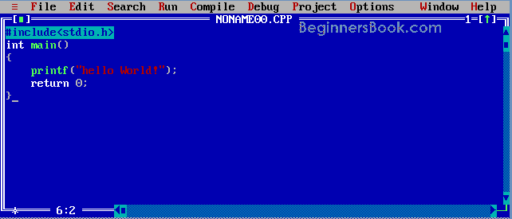
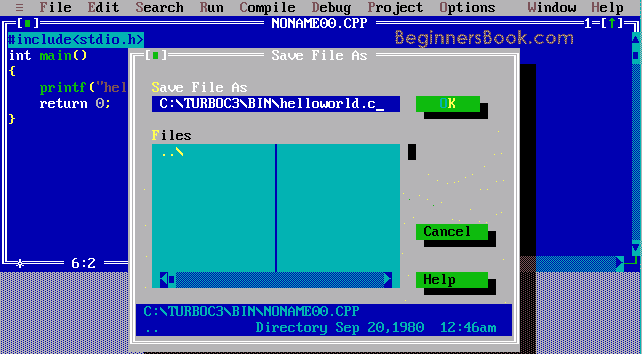
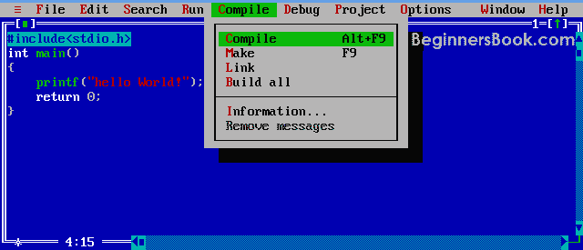
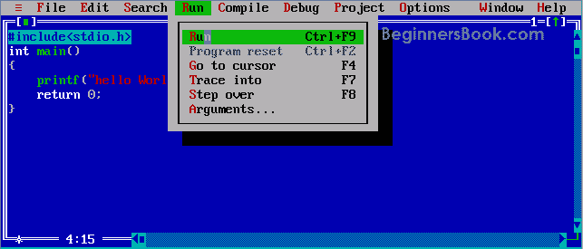

# 如何安装 Turbo C++：编译并运行 C 程序

> 原文： [https://beginnersbook.com/2014/01/install-turbo-c/](https://beginnersbook.com/2014/01/install-turbo-c/)

您需要了解的第一件事是计算机（机器）只能理解机器语言（流 0 和 1）。为了将您的 C 程序源代码转换为机器代码，您需要编译它。编译器是将源代码转换为机器代码的编译器。简单来说，您可以说编译器将人类可读代码转换为机器可读格式。

## 安装 Turbo C++：分步指南

**下载链接**：[下载适用于 Windows 的 Turbo C++](https://download.cnet.com/TurboC-for-Windows/3000-2212_4-75786077.html)

**步骤 1** ：找到 TC.exe 文件并将其打开。你会在位置 **C：\ TC \ BIN \找到它。**

**步骤 2** ：文件&gt;新建（如上图所示）然后编写 C 程序

```c
#include<stdio.h>
int main()
{
       printf("hello World!");
       return 0;
}
```


**第 3 步**：使用 F2（OR 文件&gt;保存）保存程序，记住扩展名应为“.c”。在下面的屏幕截图中，我将名称命名为 helloworld.c。

**步骤 4** ：使用 Alt + F9 **或**编译&gt;编译程序。编译（如下面的屏幕截图所示）。

**步骤 5** ：按 Ctrl + F9 运行（或选择运行&gt;在菜单栏中运行）C 程序。

**步骤 6** ：Alt + F5 查看输出屏幕上程序的输出。


## 使用 gcc 编译器编译和运行 C 程序

我们已经看到了使用 Turbo C++编译和执行 C 程序的步骤。我们也可以使用 gcc 编译器来做同样的事情。步骤如下：

**源代码** **Helloworld.c（文件应始终以.c 扩展名保存）**

```c
# include<stdio.h>
int main()
{
         puts ("hello World");
         return 0;
}
```

**编译它**（它基本上是将 helloworld.c 文件转换为 helloworld 文件）

```c
>gcc  helloworld.c  –o  helloworld
>
```

如果您在 Windows 上编译，生成的文件将是 helloworld.exe。

**运行已编译的程序**
一旦你给出了上面的命令，如果你在 Windows 上就会创建一个.exe 文件，然后输入以下命令来运行源代码。

**适用于 Windows**

```c
>helloworld
```

**适用于 Mac 和 Linux 操作系统**

```c
>./helloworld
```

gcc 编译器采用人类可读格式（helloworld.c 文件）并转换为 Windows，Linux 和 Mac OS X 的机器代码。