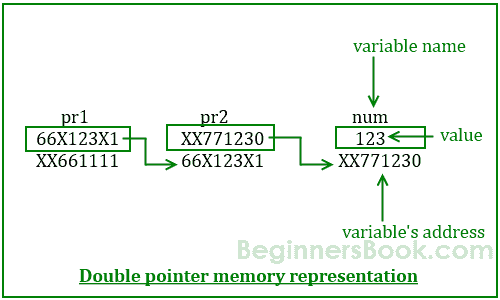

# C - 指向指针的指针（双重指针）

> 原文： [https://beginnersbook.com/2014/01/c-pointer-to-pointer/](https://beginnersbook.com/2014/01/c-pointer-to-pointer/)

我们已经知道指针保存了同一类型的另一个变量的地址。当指针保存另一个指针的地址时，这种类型的指针称为**指针的指针**或**双重指针**。在本指南中，我们将学习什么是双重指针，如何声明它们以及如何在 C 编程中使用它们。要理解这个概念，你应该知道[指针](https://beginnersbook.com/2014/01/c-pointers/)的基础知识。

## 如何在 C 中声明指针的指针（双重指针）？

```c
int **pr;
```

这里 pr 是一个双重指针。在双重指针的声明中必须有两个*。

让我们借助图表来理解双重指针的概念：


根据图表，pr2 是一个普通指针，它保存整数变量 num 的地址。图中还有另一个指针 pr1，它保存另一个指针 pr2 的地址，这里的指针 pr1 是一个指向指针的指针（或双重指针）。

**上图中的数值：**

```c
Variable num has address: XX771230
Address of Pointer pr1 is: XX661111
Address of Pointer pr2 is: 66X123X1
```

## 双重指针示例

让我们根据上面看到的图表编写一个 C 程序。

```c
#include <stdio.h>
int main()
{
     int num=123;

     //A normal pointer pr2
     int *pr2;

     //This pointer pr2 is a double pointer
     int **pr1;

     /* Assigning the address of variable num to the
      * pointer pr2
      */
     pr2 = #

     /* Assigning the address of pointer pr2 to the
      * pointer-to-pointer pr1
      */
     pr1 = &pr2;

     /* Possible ways to find value of variable num*/
     printf("\n Value of num is: %d", num);
     printf("\n Value of num using pr2 is: %d", *pr2);
     printf("\n Value of num using pr1 is: %d", **pr1);

     /*Possible ways to find address of num*/
     printf("\n Address of num is: %p", &num);
     printf("\n Address of num using pr2 is: %p", pr2);
     printf("\n Address of num using pr1 is: %p", *pr1);

     /*Find value of pointer*/
     printf("\n Value of Pointer pr2 is: %p", pr2);
     printf("\n Value of Pointer pr2 using pr1 is: %p", *pr1);

     /*Ways to find address of pointer*/
     printf("\n Address of Pointer pr2 is:%p",&pr2);
     printf("\n Address of Pointer pr2 using pr1 is:%p",pr1);

     /*Double pointer value and address*/
     printf("\n Value of Pointer pr1 is:%p",pr1);
     printf("\n Address of Pointer pr1 is:%p",&pr1);

     return 0;
}

```

**输出：**

```c
Value of num is: 123
Value of num using pr2 is: 123
Value of num using pr1 is: 123
Address of num is: XX771230
Address of num using pr2 is: XX771230
Address of num using pr1 is: XX771230
Value of Pointer pr2 is: XX771230
Value of Pointer pr2 using pr1 is: XX771230
Address of Pointer pr2 is: 66X123X1
Address of Pointer pr2 using pr1 is: 66X123X1
Value of Pointer pr1 is:  66X123X1
Address of Pointer pr1 is: XX661111
```

> 关于此程序的输出存在一些混淆，当您运行此程序时，您将看到类似于此的地址：0x7fff54da7c58。我以不同格式提供地址的原因是因为我希望您将此程序与上图相关联。我已经使用了上图中的确切地址值，因此您可以轻松地将此程序的输出与上图相关联。

您还可以使用以下简单公式了解程序逻辑：

```c
num == *pr2 == **pr1
&num == pr2 == *pr1
&pr2 == pr1
```