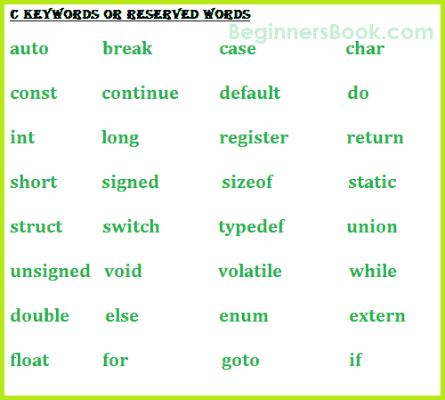

# C 关键词 - 保留字

> 原文： [https://beginnersbook.com/2014/01/c-keywords-reserved-words/](https://beginnersbook.com/2014/01/c-keywords-reserved-words/)

在 C 中，我们有 32 个关键字，它们具有预定义，不能用作变量名。这些词也被称为“保留词”。最好避免将这些关键字用作变量名。这些是 -

**这些关键字的基础用法 -**

**if，else，switch，case，default -** 用于决策控制编程结构。

**break -** 用于任何循环 OR 开关盒。

**int，float，char，double，long -** 这些是数据类型，在变量声明期间使用。

**for，while，** - C 中的循环结构类型。

**void -** 其中一种返回类型。

**goto -** 用于重定向执行流程。

**auto，signed，const，extern，register，unsigned -** 定义一个变量。

**return -** 该关键字用于返回值。

**continue -** 它通常与 for，while 和 dowhile 循环一起使用，当编译器遇到此语句时，它执行循环的下一次迭代，跳过当前迭代的其余语句。

**枚举 -** 常量集。

**sizeof -** 用于了解尺寸。

**struct，** **typedef** - 结构中使用的这两个关键字（单个记录中的数据类型分组）。

**union -** 它是一组变量，它们共享相同的内存位置和内存存储。

**挥发性**