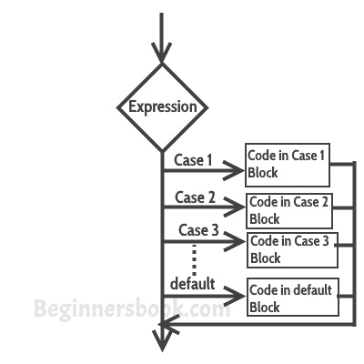

# C 编程的`switch-case`语句

> 原文： [https://beginnersbook.com/2014/01/switch-case-statements-in-c/](https://beginnersbook.com/2014/01/switch-case-statements-in-c/)

当我们有多个选项时，使用**`switch-case`语句**，我们需要为每个选项执行不同的任务。

## C - `switch-case`语句

语法：

```c
switch (variable or an integer expression)
{
     case constant:
     //C Statements
     ;
     case constant:
     //C Statements
     ;
     default:
     //C Statements
     ;
}
```

### `switch-case`流程图



### C 中的`switch-case`示例

```c
#include <stdio.h>
int main()
{
     int num=2;
     switch(num+2)
     {
         case 1:
           printf("Case1: Value is: %d", num);
         case 2:
           printf("Case1: Value is: %d", num);
         case 3:
           printf("Case1: Value is: %d", num);
         default:
           printf("Default: Value is: %d", num);
    }
    return 0;
}

```

**输出：**

```c
Default: value is: 2
```

**说明：**在`switch`中我给出了一个表达式，你也可以给变量。我给了`num + 2`，其中`num`值是 2，并且在相加之后表达式得到 4。因为没有用值 4 定义的情况，所以执行默认情况。

### 怪异故事 - 介绍`break`语句

在我们讨论更多关于[`break`语句](https://beginnersbook.com/2014/01/c-break-statement/)之前，请猜测这个 C 程序的输出。

```c
#include <stdio.h>
int main()
{
     int i=2;
     switch (i)
     {
        case 1:
           printf("Case1 ");
        case 2:
           printf("Case2 ");
        case 3:
           printf("Case3 ");
        case 4:
           printf("Case4 ");
        default:
           printf("Default ");
     }
    return 0;
}
```

**输出：**

```c
Case2 Case3 Case4 Default
```

我传递了一个变量给`switch`，变量的值是 2，所以控制跳转到`case` 2，但是在上面的程序中没有这样的语句可以在`case` 2 执行后打破流程。这就是`case 2`之后，所有后续`case`和默认语句都已执行的原因。

**如何避免这种情况？**

我们可以使用`break`语句来打破每个`case`块之后的控制流。

### `switch-case`中的`break`语句

当您希望程序流从`switch`中出来时，`break`语句很有用。每当在`switch`体中遇到`break`语句时，控制流都会出现在`switch case`语句外。

**具有`break`的`switch-case`示例**

和在上面看到的相同，但这次我们正在使用`break`。

```c
#include <stdio.h>
int main()
{
     int i=2;
     switch (i)
     {
          case 1:
             printf("Case1 ");
             break;
          case 2:
             printf("Case2 ");
             break;
          case 3:
             printf("Case3 ");
             break;
          case 4:
             printf("Case4 ");
             break;
          default:
             printf("Default ");
     }
     return 0;
}
```

**输出：**

```c
Case 2
```

**为什么`default`后不使用`break`语句？**

控制流本身会在默认情况下从`switch`中出来，所以我没有使用它，但是如果你想在默认情况下使用它，你可以使用它，这样做没有坏处。

## 关于`switch-case`的几个重点

1）`case`并不总是需要顺序`1,2,3`等。它们可以在`case`关键字后面包含任何整数值。此外，`case`不需要始终按升序排列，您可以根据程序的需要以任何顺序指定它们。

2）您也可以在`switch-case`中使用字符。例如：

```c
#include <stdio.h>
int main()
{
     char ch='b';
     switch (ch)
     {
         case 'd':
            printf("CaseD ");
            break;
         case 'b':
            printf("CaseB");
            break;
         case 'c':
            printf("CaseC");
            break;
         case 'z':
            printf("CaseZ ");
            break;
         default:
            printf("Default ");
    }
    return 0;
}
```

输出：

```c
CaseB
```

3）`switch`中提供的表达式应该产生一个常量值，否则它将无效。

例如：

**`switch`的有效表达式：**

```c
switch(1+2+23)
switch(1*2+3%4)
```

**无效的`switch`表达式：**

```c
switch(ab+cd)
switch(a+b+c)
```

4）允许嵌套`switch`语句，这意味着你可以在另一个`switch`内部使用`switch`语句。但是应该避免使用嵌套的`switch`语句，因为它会使程序更复杂，更不易读。