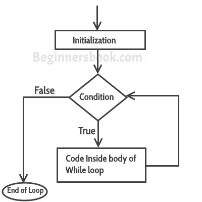

# C++中的`while`循环

> 原文： [https://beginnersbook.com/2017/08/cpp-while-loop/](https://beginnersbook.com/2017/08/cpp-while-loop/)

在上一篇教程中，我们讨论了 [for loop](https://beginnersbook.com/2017/08/cpp-for-loop/) 。在本教程中，我们将讨论 while 循环。如前所述，循环用于重复执行程序语句块，直到给定的循环条件返回 false。

#### `while`循环的语法

```
while(condition)
{
   statement(s);
}
```

## 循环如何工作？

在 while 循环中，首先计算条件，如果它返回 true，则 while 循环中的语句执行，这会重复发生，直到条件返回 false。当 condition 返回 false 时，控件退出循环并在 while 循环后跳转到程序中的下一个语句。

**注意：**使用 while 循环时要注意的重点是我们需要在 while 循环中使用递增或递减语句，以便循环变量在每次迭代时都会发生变化，并且在某些情况下返回 false。这样我们就可以结束 while 循环的执行，否则循环将无限期地执行。

### `while`循环流程图



## C++中的`while`循环示例

```
#include <iostream>
using namespace std;
int main(){
   int i=1;
   /* The loop would continue to print
    * the value of i until the given condition
    * i<=6 returns false.
    */
   while(i<=6){
      cout<<"Value of variable i is: "<<i<<endl; i++;
   }
}
```

**输出：**

```
Value of variable i is: 1
Value of variable i is: 2
Value of variable i is: 3
Value of variable i is: 4
Value of variable i is: 5
Value of variable i is: 6
```

## 无限循环

永远停止的 while 循环被认为是无限循环，当我们以这样的方式给出条件以使它永远不会返回 false 时，循环变为无限并且无限地重复。
**无限循环的一个例子：**
这个循环永远不会结束，因为我递减 i 的值为 1，因此条件 i&lt; = 6 永远不会返回 false。

```
#include <iostream>
using namespace std;
int main(){
   int i=1; while(i<=6) {
      cout<<"Value of variable i is: "<<i<<endl; i--;
   }
}
```

## 示例：使用`while`循环显示数组元素

```
#include <iostream>
using namespace std;
int main(){
   int arr[]={21,87,15,99, -12};
   /* The array index starts with 0, the
    * first element of array has 0 index
    * and represented as arr[0]
    */
   int i=0;
   while(i<5){
      cout<<arr[i]<<endl;
      i++;
   }
}
```

**Output:**

```
21
87
15
99
-12

```