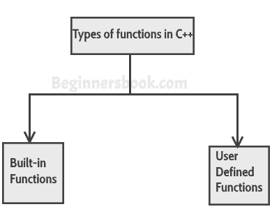
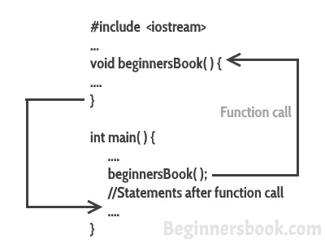

# C++中的函数

> 原文： [https://beginnersbook.com/2017/08/cpp-functions/](https://beginnersbook.com/2017/08/cpp-functions/)

函数是用于执行特定任务的代码块，例如，假设您正在编写一个大型 C++程序，并且在该程序中，您希望多次执行特定任务，例如显示从 1 到 10 的值，为了做到这一点，你必须编写几行代码，每次显示值时都需要重复这些行。另一种方法是在函数内写入这些行，并在每次要显示值时调用该函数。这将使您的代码简单，可读和可重用。

#### 函数的语法

```
return_type function_name (parameter_list)
{
   //C++ Statements
}

```

让我们举一个简单的例子来理解这个概念。

## 一个简单的函数示例

```
#include <iostream>
using namespace std;
/* This function adds two integer values
 * and returns the result
 */int
sum(int num1, int num2){
   int num3 = num1+num2; return num3;
}

int main(){
   //Calling the function
   cout<<sum(1,99);
   return 0;
}
```

**输出：**

```
100
```

**同样的程序可以这样写：**好吧，我正在编写这个程序，让你理解一个关于函数的重要术语，即函数声明。让我们先看看程序，然后在最后讨论函数声明，定义和函数调用。

```
#include <iostream>
using namespace std;
//Function declaration
int sum(int,int);

//Main function
int main(){
   //Calling the function
   cout<<sum(1,99);
   return 0;
}
/* Function is defined after the main method 
 */
int sum(int num1, int num2){
   int num3 = num1+num2;
   return num3;
}
```

**函数声明：**你已经看到我用两种方式编写了相同的程序，在第一个程序中我没有任何函数声明，在第二个程序中我在程序开头有函数声明。问题是，当您在程序中的 main（）函数之前定义函数时，您不需要执行函数声明，但如果您在 main（）函数之后编写函数，就像我们在第二个程序中那样，那么您需要先声明函数，否则会出现编译错误。

**函数声明的语法：**

```
return_type function_name(parameter_list);
```

**注意：**在提供 parameter_list 时，您可以避免参数名称，就像我在上面的示例中所做的那样。我给了`int sum(int,int);`而不是`int sum(int num1,int num2);`。

**函数定义：**编写函数的全部函数称为定义函数。
**函数定义语法：**

```
return_type function_name(parameter_list) {
    //Statements inside function
}

```

**调用函数：**我们可以像这样调用函数：

```
function_name(parameters);
```

现在我们已经理解了函数的**工作，让我们看看 C++中的函数类型**

## 函数类型

我们在 C++中有两种类型的函数：


1）内置函数
2）用户定义的函数

### 1）内置函数

内置函数也称为库函数。我们不需要声明和定义这些函数，因为它们已经在 C++库中编写，例如 iostream，cmath 等。我们可以在需要时直接调用它们。

#### 示例：C++内置函数示例

这里我们使用内置函数 pow（x，y），它是 x 的幂 y。此函数在`cmath`头文件中声明，因此我们使用`#include`指令将该文件包含在我们的程序中。

```
#include <iostream>
#include <cmath>
using namespace std;
int main(){
    /* Calling the built-in function 
     * pow(x, y) which is x to the power y
     * We are directly calling this function
     */
    cout<<pow(2,5);
    return 0;
}
```

**
输出：**

```
32
```

### 2）用户定义的函数


我们已经看过用户定义的函数，我们在本教程开头给出的示例是用户定义函数的示例。我们在程序中声明和写入的函数是用户定义的函数。让我们看另一个用户定义函数的例子。

#### 用户定义的函数

```
#include <iostream>
#include <cmath>
using namespace std;
//Declaring the function sum
int sum(int,int);

int main(){
   int x, y;
   cout<<"enter first number: ";
   cin>> x;

   cout<<"enter second number: ";
   cin>>y;

   cout<<"Sum of these two :"<<sum(x,y);
   return 0;
}
//Defining the function sum
int sum(int a, int b) {
   int c = a+b;
   return c;
}
```

**Output:**

```
enter first number: 22
enter second number: 19
Sum of these two :41
```