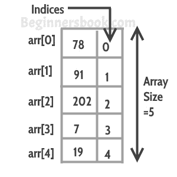

# C++ 中的数组

> 原文： [https://beginnersbook.com/2017/08/cpp-arrays/](https://beginnersbook.com/2017/08/cpp-arrays/)

数组是存储在连续内存位置的类似项的集合。在编程中，有时一个简单的变量不足以容纳所有数据。例如，假设我们要存储 500 名学生的信息，这个任务有 500 个不同的变量是不可行的，我们可以定义一个大小为 500 的数组，可以保存所有学生的信息。



## 用 C++声明一个数组

有几种方法可以声明一个数组。

方法 1：

```cpp
int arr[5];
arr[0] = 10;
arr[1] = 20;
arr[2] = 30;
arr[3] = 40;
arr[4] = 50;
```

方法 2：

```cpp
int arr[] = {10, 20, 30, 40, 50};
```

方法 3：

```cpp
int arr[5] = {10, 20, 30, 40, 50};
```

## 访问数组元素

数组索引以 0 开头，这意味着第一个数组元素位于索引 0，第二个数据元素位于索引 1，依此类推。我们可以使用此信息来显示数组元素。请参阅以下代码：

```cpp
#include <iostream>
using namespace std;

int main(){
   int arr[] = {11, 22, 33, 44, 55};
   cout<<arr[0]<<endl;
   cout<<arr[1]<<endl;
   cout<<arr[2]<<endl;
   cout<<arr[3]<<endl;
   cout<<arr[4]<<endl;
   return 0;
}
```

**输出：**

```cpp
11
22
33
44
55

```

尽管此代码工作正常，但不建议显示此类数组的所有元素。当你想访问一个特定的数组元素时，这很好，但如果你想显示所有元素，那么你应该使用这样的循环：

```cpp
#include <iostream>
using namespace std;

int main(){
   int arr[] = {11, 22, 33, 44, 55};
   int n=0;

   while(n<=4){
      cout<<arr[n]<<endl;
      n++;
   }
   return 0;
}
```