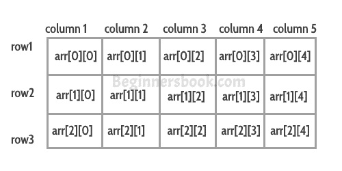

# C++中的多维数组

> 原文： [https://beginnersbook.com/2017/08/cpp-multidimensional-arrays/](https://beginnersbook.com/2017/08/cpp-multidimensional-arrays/)

多维数组也称为**数组**数组。多维数组中的数据以表格形式存储，如下图所示：


**二维数组：**

```cpp
int arr[2][3];
```

该数组总共有 2 * 3 = 6 个元素。

**三维数组：**

```cpp
int arr[2][2][2];
```

该数组总共有 2 * 2 * 2 = 8 个元素。

## 二维数组

让我们看看如何声明，初始化和访问 Two Dimensional Array 元素。

**如何声明二维数组？**

```cpp
int myarray[2][3];
```

**初始化：**
我们可以通过多种方式初始化数组：
**方法 1：**

```cpp
int arr[2][3] = {10, 11 ,12 ,20 ,21 , 22};
```

**方法 2：**
这种初始化方式是首选，因为您可以在此处显示行和列。

```cpp
int arr[2][3] = {{10, 11 ,12} , {20 ,21 , 22}};
```

**访问数组元素：**
arr [0] [0] - 第一个元素
arr [0] [1] - 第二个元素
arr [0] [2] - 第三个元素[
arr [1] [0] - 第四元素
arr [1] [1] - 第五元素
arr [1] [2] - 第六元素

### 示例：C++中的二维数组

```cpp
#include <iostream>
using namespace std;

int main(){
   int arr[2][3] = {{11, 22, 33}, {44, 55, 66}};
   for(int i=0; i<2;i++){
      for(int j=0; j<3; j++){
        cout<<"arr["<<i<<"]["<<j<<"]: "<<arr[i][j]<<endl;
      }
   }
   return 0;
}
```

**输出：**

```cpp
arr[0][0]: 11
arr[0][1]: 22
arr[0][2]: 33
arr[1][0]: 44
arr[1][1]: 55
arr[1][2]: 66

```

## 三维数组

让我们看看如何声明，初始化和访问三维数组元素。

**声明三维数组：**

```cpp
int myarray[2][3][2];
```

**Initialization:**
We can initialize the array in many ways:
**Method 1:**

```cpp
int arr[2][3][2] = {1, -1 ,2 ,-2 , 3 , -3, 4, -4, 5, -5, 6, -6};

```

**Method 2:**
This way of initializing is preferred as you can visualize the rows and columns here.

```cpp
int arr[2][3][2] = {
     { {1,-1}, {2, -2}, {3, -3}},
     { {4, -4}, {5, -5}, {6, -6}}
}
```

## 三维数组示例

```cpp
#include <iostream>
using namespace std;

int main(){
   // initializing the array
   int arr[2][3][2] = {
      { {1,-1}, {2,-2}, {3,-3} },
      { {4,-4}, {5,-5}, {6,-6} }
   };
   // displaying array values 
   for (int x = 0; x < 2; x++) {
     for (int y = 0; y < 3; y++) {
       for (int z = 0; z < 2; z++) {
         cout<<arr[x][y][z]<<" ";
       }
     }
   }
   return 0;
}
```

**Output:**

```cpp
1 -1 2 -2 3 -3 4 -4 5 -5 6 -6
```

看看这些相关的 C++程序：

1.  [C++程序添加两个矩阵](https://beginnersbook.com/2017/08/cpp-program-to-add-two-matrices/)
2.  [C++程序查找并打印 Matrix](https://beginnersbook.com/2017/08/cpp-program-to-find-transpose-of-matrix/) 的转置