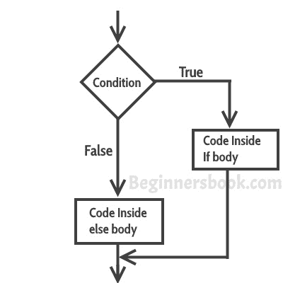

# C++中的`if`语句

> 原文： [https://beginnersbook.com/2017/08/cpp-if-else-statement/](https://beginnersbook.com/2017/08/cpp-if-else-statement/)

有时我们只有在满足或不满足特定条件时才需要执行一个语句块。这被称为**决策**，因为我们在程序逻辑中做出决定后执行某个代码。对于 C++中的决策，我们有四种类型的控制语句（或控制结构），如下所示：

a）`if`语句
b）嵌套`if`语句
c）`if-else`语句
d）`if-else-if`语句

## C++中的`if`语句

`if`语句包含条件，则后跟语句或一组语句，如下所示：

```cpp
if(condition){
  Statement(s);
}
```

`if`括号（通常称为正文）中的语句仅在给定条件为真时才执行。如果条件为假，则完全忽略正文中的语句。**

**`if`语句**的流程图


### `if`语句的示例

```cpp
#include <iostream>
using namespace std;
int main(){
  int num=70;
  if( num < 100 ){
     /* This cout statement will only execute,
      * if the above condition is true
      */ 
     cout<<"number is less than 100";
  }

  if(num > 100){
     /* This cout statement will only execute,
      * if the above condition is true
      */ 
     cout<<"number is greater than 100";
  }
  return 0;
}
```

**输出：**

```cpp
number is less than 100
```

## C++中的嵌套`if`语句

当在另一个`if`语句中有`if`语句时，它被称为**嵌套`if`语句**。
嵌套的结构如下所示：

```cpp
if(condition_1) {
   Statement1(s);

   if(condition_2) {
      Statement2(s);
   }
}
```

> 如果 condition_1 为 true，则执行 Statement1。只有条件（condition_1 和 condition_2）都为真时，Statement2 才会执行。

### 嵌套`if`语句的示例

```cpp
#include <iostream>
using namespace std;
int main(){
   int num=90;
   /* Nested if statement. An if statement
    * inside another if body
    */
   if( num < 100 ){
      cout<<"number is less than 100"<<endl;
      if(num > 50){
         cout<<"number is greater than 50";
      } 
   }
   return 0;
}
```

**输出：**

```cpp
number is less than 100
number is greater than 50
```

## 在 C++中使用`if-else`语句

有时你有一个条件，如果条件为真，你想要执行一段代码，如果相同的条件为假，则执行另一段代码。这可以使用`if-else`语句在 C++中实现。

这是`if-else`语句的外观：

```cpp
if(condition) {
   Statement(s);
}
else {
   Statement(s);
}
```

如果条件为真，则`if`内的语句将执行，如果条件为假，则`else`内的语句将执行。

**if-else**
的流程图

### `if-else`语句的示例

```cpp
#include <iostream>
using namespace std;
int main(){
   int num=66;
   if( num < 50 ){
      //This would run if above condition is true
      cout<<"num is less than 50";
   }
   else {
      //This would run if above condition is false
      cout<<"num is greater than or equal 50";
   }
   return 0;
}
```

**输出：**

```cpp
num is greater than or equal 50
```

## C++中的`if-else-if`语句

当我们需要检查多个条件时使用`if-else-if`语句。在这个控制结构中，我们只有一个`if`和一个`else`，但是我们可以有多个`else if`块。这是它的样子：

```cpp
if(condition_1) {
   /*if condition_1 is true execute this*/
   statement(s);
}
else if(condition_2) {
   /* execute this if condition_1 is not met and
    * condition_2 is met
    */
   statement(s);
}
else if(condition_3) {
   /* execute this if condition_1 & condition_2 are
    * not met and condition_3 is met
    */
   statement(s);
}
.
.
.
else {
   /* if none of the condition is true
    * then these statements gets executed
    */
   statement(s);
}
```

**注意：**这里要注意的最重要的一点是，在`if-else-if`中，只要满足条件，就会执行相应的语句集，忽略其余。如果没有满足条件，则执行`else`内的语句。

### `if-else-if`的示例

```cpp
#include <iostream>
using namespace std;
int main(){
   int num;
   cout<<"Enter an integer number between 1 & 99999: ";
   cin>>num;
   if(num <100 && num>=1) {
      cout<<"Its a two digit number";
   }
   else if(num <1000 && num>=100) {
      cout<<"Its a three digit number";
   }
   else if(num <10000 && num>=1000) {
      cout<<"Its a four digit number";
   }
   else if(num <100000 && num>=10000) {
      cout<<"Its a five digit number";
   }
   else {
      cout<<"number is not between 1 & 99999";
   }
   return 0;
}
```

**输出：**

```cpp
Enter an integer number between 1 & 99999: 8976
Its a four digit number
```