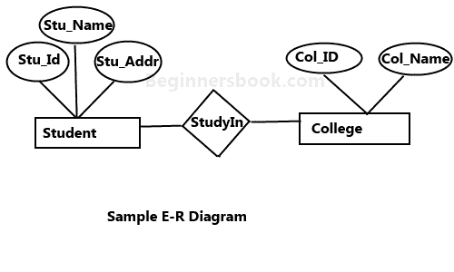
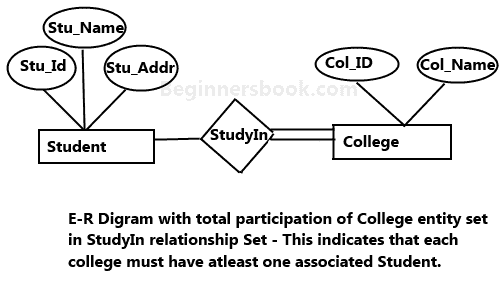

# 实体关系图 - DBMS 中的 ER 图

> 原文： [https://beginnersbook.com/2015/04/e-r-model-in-dbms/](https://beginnersbook.com/2015/04/e-r-model-in-dbms/)

**实体关系模型（ER 模型）**借助于图来描述数据库的结构，其被称为**实体关系图（ER 图）**。 ER 模型是数据库的设计或蓝图，以后可以实现为数据库。 E-R 模型的主要组成部分是：实体集和关系集。

## 什么是实体关系图（ER 图）？

ER 图显示了实体集之间的关系。实体集是一组相似的实体，这些实体可以具有属性。就 DBMS 而言，实体是数据库中表的表或属性，因此通过显示表及其属性之间的关系，ER 图显示了数据库的完整逻辑结构。让我们看一个简单的 ER 图来理解这个概念。

## 一个简单的 ER 图：

在下图中，我们有两个实体`Student`和`College`及其关系。`Student`与`College`之间的关系是多对一的，因为大学可以有很多学生，但学生不能同时在多所大学学习。`Student`实体具有诸如`Stu_Id`，`Stu_Name`和 `Stu_Addr`等属性。`College`实体具有`Col_ID`和`COL_NAME`等属性。

以下是 E-R 图中的几何形状及其含义。我们将在本指南的下一部分（ER 图的组成部分）中详细讨论这些术语，所以现在不要过多担心这些术语，只需浏览一次。

**矩形** ：表示实体集。
**椭圆**：属性
**菱形**：关系集
**直线**：它们将属性链接到实体集，将实体集链接到关系集
**双椭圆：**多值属性
**虚线椭圆**：派生属性
**双矩形**：弱实体集
**双线**：实体在关系集中的完全参与

## ER 图的组成部分

如上图所示，ER 图有三个主要组成部分：

1. 实体
2. 属性
3. 关系

### 1\. 实体

实体是数据的对象或组件。实体在 ER 图中表示为矩形。

例如：在下面的 ER 图中，我们有两个实体学生和学院，这两个实体有多对一的关系，因为许多学生在一所大学学习。我们稍后会阅读更多关于关系的内容，现在关注实体。

**弱实体：**

无法通过其自身属性唯一标识并依赖于与其他实体的关系的实体称为弱实体。弱实体由双矩形表示。例如，如果不知道该帐户所属的银行，就无法唯一识别银行帐户，因此银行帐户是一个弱实体。

### 2\. 属性

属性描述实体的属性。 ER 图中的属性表示为椭圆。有四种类型的属性：

1.  关键属性
2.  复合属性
3.  多值属性
4.  派生属性

#### 1\. 关键属性：

关键属性可以唯一地标识实体集中的实体。例如，学生编号可以唯一地标识来自一组学生的学生。关键属性由椭圆表示，与其他属性相同，但关键属性的**文本加下划线**。

#### 2\. 复合属性：

属于其他属性组合的属性称为复合属性。例如，在学生实体中，学生地址是复合属性，因为地址由其他属性组成，例如密码，状态，国家。

#### 3\. 多值属性：

可以包含多个值的属性称为多值属性。它在 ER 图中用**双椭圆**表示。例如 - 一个人可以拥有多个电话号码，因此电话号码属性是多值的。

#### 4\. 派生属性：

派生属性的值是动态的，并且是从另一个属性派生的。它由 ER 图中的**虚线椭圆**表示。例如 - `Person age`是一个派生属性，因为它随时间变化，可以从另一个属性（出生日期）派生。

具有多值和派生属性的 **E-R 图**：

### 3\. 关系

ER 图中的菱形表示关系，表示实体之间的关系。有四种类型的关系：

1. 一对一
2. 一对多
3. 多对一
4. 多对多

#### 1\. 一对一的关系

当实体的单个实例与另一个实体的单个实例相关联时，它被称为一对一关系。例如，一个人只有一本护照，一本护照只能被一个人获得。

#### 2\. 一对多的关系

当一个实体的单个实例与另一个实体的多个实例相关联时，它被称为一对多关系。例如 - 客户可以下许多订单，但许多客户无法下一个订单。

#### 3\. 多对一的关系

当实体的多个实例与另一个实体的单个实例相关联时，它被称为多对一关系。例如，许多学生可以在一所大学学习，但学生不能同时在许多大学学习。

#### 4\. 多对多关系

当一个实体的多个实例与另一个实体的多个实例相关联时，它被称为多对多关系。例如，可以将学生分配给许多项目，并将项目分配给许多学生。

## 实体集的完全参与

实体集的完全参与表示实体集中的每个实体必须在关系集中具有至少一个关系。例如：在下图中，每个学院必须至少有一个相关的学生。

