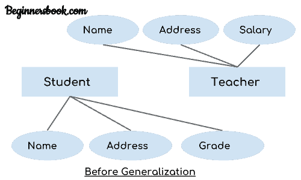
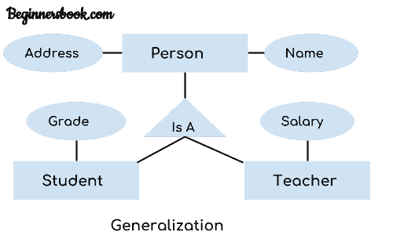

# DBMS 泛化

> 原文： [https://beginnersbook.com/2018/11/dbms-generalization/](https://beginnersbook.com/2018/11/dbms-generalization/)

**泛化**是一个过程，其中多个实体的共同属性构成一个新实体。这个新形成的实体称为广义实体。

## 概括示例

让我们说我们有两个实体学生和老师。
实体学生的属性是：姓名，地址&amp;实体教师的等级
属性是：姓名，地址和等级。薪水

**泛化前的 ER 图如下所示：**

这两个实体有两个共同的属性：Name 和 Address，我们可以使用这些公共属性创建一个通用实体。让我们看一下泛化后的 ER 模型。

**概括后的 ER 图：**
我们创建了一个新的广义实体 Person，这个实体具有两个实体的共同属性。正如你在下面的 [ER 图](https://beginnersbook.com/2015/04/e-r-model-in-dbms/)中看到的那样，在泛化过程之后，实体 Student 和 Teacher 分别只有 Grade 和 Salary 的专用属性，它们的公共属性（Name&amp; Address）现在与一个新的相关联实体与两个实体（学生和教师）有关系的人。

**注：**
1.泛化使用自下而上的方法，其中两个或多个较低级别的实体组合在一起形成更高级别的新实体。
2.新的广义实体可以进一步与较低级别的实体组合在一起，以创建更高级别的广义实体。