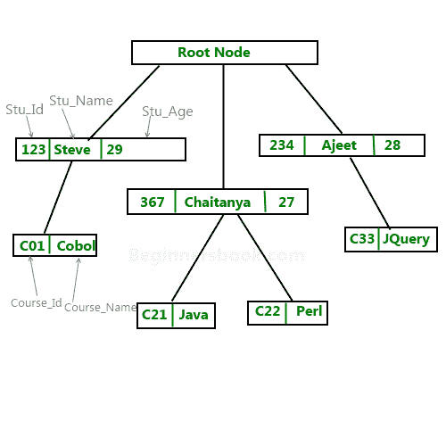

# DBMS 中的分层模型

> 原文： [https://beginnersbook.com/2015/04/hierarchical-model-in-dbms/](https://beginnersbook.com/2015/04/hierarchical-model-in-dbms/)

在**分层模型**中，数据被组织成树状结构，每个记录具有一个父记录和许多子记录。该模型的主要缺点是，节点之间只能有一对多的关系。

**注意：现在很少使用分层模型。**

**样本层次模型图**：
让我们说我们的学生很少，课程很少，只有一个学生可以分配课程，但是学生可以选修任意数量的课程，这样这种关系就变成了一对多。

**表示为关系表的分层数据示例：**上述分层模型可以表示为关系表，如下所示：

| Stu_Id | Stu_Name | Stu_Age |
| 123 | 史蒂夫 | 29 |
| 367 | 切塔尼亚 | 27 |
| 234 | Ajeet | 28 |

课程表：

| COURSE_ID | 课程名 | Stu_Id |
| C01 | COBOL | 123 |
| C21 | Java 的 | 367 |
| C22 | Perl 的 | 367 |
| C33 | JQuery 的 | 234 |