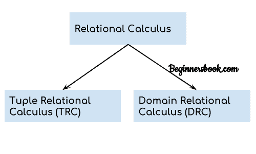

# DBMS 关系演算

> 原文： [https://beginnersbook.com/2019/02/dbms-relational-calculus/](https://beginnersbook.com/2019/02/dbms-relational-calculus/)

在上一个教程中，我们讨论了 [Relational Algebra](https://beginnersbook.com/2019/02/dbms-relational-algebra/) ，这是一种过程查询语言。在本教程中，我们将讨论 Relational Calculus，它是一种非过程查询语言。

## 什么是关系微积分？

关系演算是一种非过程查询语言，它告诉系统要检索哪些数据但不告诉如何检索它。

## 关系演算的类型



## 1.元组关系演算（TRC）

元组关系演算用于选择满足给定条件的元组。
表：学生

```
First_Name     Last_Name     Age
----------     ---------     ----
Ajeet          Singh         30
Chaitanya      Singh         31
Rajeev         Bhatia        27
Carl           Pratap        28

```

让我们编写关系演算查询。

查询以显示年龄大于 30 岁的学生的姓氏

```
{ t.Last_Name | Student(t) AND t.age > 30 }
```

在上面的查询中，您可以看到由|分隔的两个部分符号。第二部分是我们定义条件的地方，在第一部分中我们指定了要为所选元组显示的字段。

上述查询的结果将是：

```
Last_Name
---------
Singh

```

查询以显示姓氏为“Singh”的学生的所有详细信息

```
{ t | Student(t) AND t.Last_Name = 'Singh' }
```

**输出：**

```
First_Name     Last_Name     Age
----------     ---------     ----
Ajeet          Singh         30
Chaitanya      Singh         31

```

## 2.域关系演算（DRC）

在域关系演算中，记录基于域进行过滤。
我们再次采用相同的表格来了解 DRC 的工作原理。
表：学生

```
First_Name     Last_Name     Age
----------     ---------     ----
Ajeet          Singh         30
Chaitanya      Singh         31
Rajeev         Bhatia        27
Carl           Pratap        28

```

查询查找学生年龄大于 27 岁的学生的名字和年龄

```
{< First_Name, Age > | ∈ Student ∧ Age > 27}
```

**注：**
用于逻辑运算符的符号为：∧表示 AND，∨表示 OR，┓表示 NOT。

**Output:**

```
First_Name     Age
----------     ----
Ajeet          30
Chaitanya      31
Carl           28

```