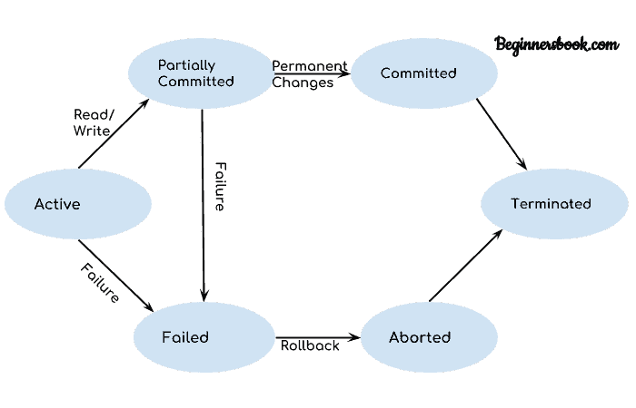

# DBMS 事务状态

> 原文： [https://beginnersbook.com/2018/12/dbms-transaction-states/](https://beginnersbook.com/2018/12/dbms-transaction-states/)

在本指南中，我们将讨论 DBMS 中事务的**状态。 DBMS 中的事务可以处于以下状态之一。**

## DBMS 事务状态图

让我们一个一个地讨论这些状态。

## 活跃状态

正如我们在 [DBMS 事务介绍](https://beginnersbook.com/2017/09/transaction-management-in-dbms/)中所讨论的那样，事务是一系列操作。如果一个事务正在执行，那么它被称为处于活动状态。执行哪个步骤无关紧要，除非事务正在执行，否则它将保持活动状态。

## 故障状态

如果事务正在执行并且发生故障（硬件故障或软件故障），则事务将从活动状态进入故障状态。

## 部分提交状态

正如我们在上图中所看到的，当事务中存在读写操作时，事务从活动状态进入“部分提交”状态。

事务包含许多读写操作。一旦整个事务成功执行，事务就进入部分提交状态，我们在主存储器（本地存储器）而不是实际数据库上执行所有读写操作。

我们拥有此状态的原因是因为事务在执行期间可能会失败，因此如果我们在实际数据库而不是本地内存中进行更改，则数据库可能会在出现任何故障时保持不一致状态。 **此状态帮助我们回滚在执行过程中发生故障时对数据库所做的更改。**

## 提交状态

如果事务成功完成执行，则在**部分提交**状态期间在本地存储器中进行的所有更改将永久存储在数据库中。您还可以在上图中看到，当一切成功时，事务从部分提交状态变为已提交状态。

## 失败状态

如上所述，如果事务在执行期间失败，则事务将进入失败状态。对本地内存（或缓冲区）所做的更改将回滚到先前的一致状态，并且事务将从失败状态进入中止状态。请参阅图表以查看失败和中止状态之间的相互作用。