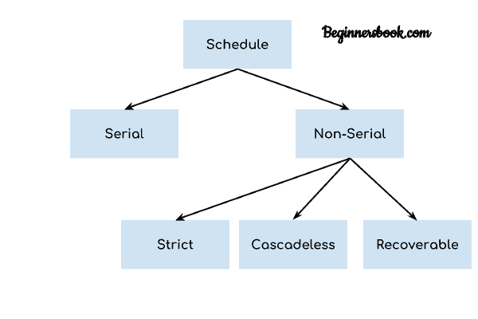

# DBMS 调度和调度类型

> 原文： [https://beginnersbook.com/2018/12/dbms-schedules/](https://beginnersbook.com/2018/12/dbms-schedules/)

我们知道[事务](https://beginnersbook.com/2017/09/transaction-management-in-dbms/)是一组指令，这些指令在数据库上执行操作。当多个事务同时运行时，需要有一个执行操作的序列，因为一次只能对数据库执行一个操作。这一系列操作称为 **调度** 。

让我们举个例子来了解 DBMS 中的调度是什么。

## DBMS 调度示例

以下操作顺序是调度。这里我们有两个事务`T1`和`T2`同时运行。

此调度确定将在数据库上执行的操作的确切顺序。在这个例子中，事务`T1`的所有指令都在事务`T2`的指令之前执行，但是这并不总是必要的，我们可以有各种类型的调度，我们将在本文中讨论。

```
T1	T2
----    ----
R(X)	
W(X)	
R(Y)	
        R(Y)
        R(X)
        W(Y)
```

## DBMS 中的调度类型

我们在 DBMS 中有各种类型的调度。让我们逐一讨论它们。



### 串行调度

在**串行调度**中，在开始执行另一个事务之前完全执行事务。换句话说，您可以说在串行调度中，事务在当前正在运行的事务完成执行之前不会开始执行。这种类型的事务执行也称为**非交错**执行。我们上面看到的例子是连续调度。

让我们再看一个例子。

**串行调度示例**

这里`R`表示读操作，`W`表示写操作。在此示例中，事务`T2`在事务`T1`完成之前不会开始执行。

```
T1	T2
----    ----
R(A)	
R(B)	
W(A)
commit	
        R(B)
        R(A)
        W(B)
        commit
```

### 严格调度

在严格调度中，如果事务的写入操作先于另一个事务的冲突操作（读取或写入操作），则此类事务的提交或中止操作也应该在其他事务的冲突操作之前。

让我们举个例子。

**严格调度示例**

假设我们有两个事务`Ta`和`Tb`。事务`Ta`的写入操作在事务`Tb`的读取或写入操作之前，因此事务`Ta`的提交或中止操作也应该在读取或写入`Tb`之前。

```
Ta	Tb
-----   -----
R(X)	
        R(X)
W(X)	
commit	
        W(X)
        R(X)
        commit
```

这里，`Ta`的写操作`W(X)`在`Tb`的冲突操作（读或写操作）之前，因此`Tb`的冲突操作必须等待`Ta`的提交操作。

### 无级联调度

在无级联调度中，如果事务要对某个值执行读操作，则必须等到执行写入该值的事务提交。

**无级联调度示例**

例如，假设我们有两个事务`Ta`和`Tb`。`Tb`将在`Ta`的`W(X)`之后读取值`X`，然后`Tb`必须在读取`X`之前等待事务`Ta`的提交操作。

```
Ta	 Tb
-----    -----
R(X)	
W(X)	
         W(X)
commit	
         R(X)
         W(X)
         commit
```

### 可恢复的调度

在可恢复调度中，如果事务正在读取已由某个其他事务更新的值，则此事务只能在提交正在更新值的其他事务之后提交。

**可恢复调度示例**

这里`Tb`在`Ta`使用`W(X)`在`X`中进行了更改之后对`X`执行读取操作，因此`Tb`只能在`Ta`的提交操作之后提交。

```
Ta	 Tb
-----    -----
R(X)	
W(X)	
         R(X)
         W(X)
         R(X)
commit	
         commit
```