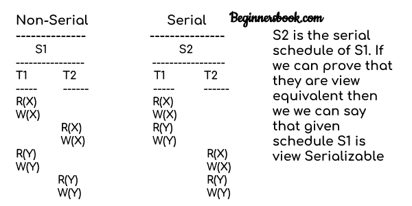

# DBMS 查看可序列化

> 原文： [https://beginnersbook.com/2018/12/dbms-view-serializability/](https://beginnersbook.com/2018/12/dbms-view-serializability/)

在上一个教程中，我们学习了 [Conflict Serializability](https://beginnersbook.com/2018/12/dbms-conflict-serializability/) 。在本文中，我们将讨论另一种可串行化，即 **View Serializability** 。

## 什么是 View Serializability？

查看可序列化是一个查找给定[计划](https://beginnersbook.com/2018/12/dbms-schedules/)视图是否可序列化的过程。

要检查给定的时间表是否可视化序列化，我们需要检查给定的时间表是否为 **View Equivalent** 到其序列时间表。让我们举个例子来理解我的意思。

**给定时间表：**

```
T1        T2
-----     ------
R(X)
W(X)
          R(X)
          W(X)
R(Y)
W(Y) 
          R(Y)
          W(Y)

```

**以上给定时间表的串行时间表：**
我们知道在[串行时间表](https://beginnersbook.com/2018/12/dbms-schedules/)中，只有在当前运行的事务完成时才会启动事务。所以上面给出的时间表的连续时间表如下所示：

```
T1        T2
-----     ------
R(X)
W(X)
R(Y)
W(Y)
          R(X)
          W(X)
          R(Y)
          W(Y)

```

如果我们能够证明给定的时间表是 **View Equivalent** 到其连续时间表，那么给定的时间表称为**视图 Serializable** 。

## 为什么我们需要 View Serializability？

我们知道，串行调度永远不会使数据库处于不一致状态，因为没有并发事务执行。但是，非串行调度可能会使数据库处于不一致状态，因为有多个事务同时运行。通过检查给定的非串行调度是否可视化序列化，我们确保它是一致的调度。

您可能想知道不是检查非串行时间表是否可序列化，我们不能一直有串行时间表吗？答案是否定的，因为事务的并发执行充分利用了系统资源，并且与串行调度相比要快得多。

## 查看等效

让我们学习如何检查两个计划是否相同。

如果它们满足以下所有条件，则称两个时间表 T1 和 T2 是等效视图：

1\. **初始读取：**事务中每个数据项的初始读取必须在两个计划中都匹配。例如，如果事务 T1 在调度 S1 中的事务 T2 之前读取数据项 X，则在调度 S2 中，T1 应该在 T2 之前读取 X.

**读取与初始读取：**您可能会对术语初始读取感到困惑。这里初始读取意味着对数据项的第一次读取操作，例如，数据项 X 可以在时间表中多次读取，但是对 X 的第一次读取操作称为初始读取。一旦我们在同一篇文章的下一部分中得到示例，这将更加清晰。

2\. **最终写入：**每个数据项的最终写操作必须在两个计划中都匹配。例如，数据项 X 最后由事务 T1 在时间表 S1 中写入，然后在 S2 中，对 X 的最后一次写操作应该由事务 T1 执行。

3\. **更新读取：**如果在时间表 S1 中，事务 T1 正在读取由 T2 更新的数据项，则在时间表 S2 中，T1 应该在相同数据项上的 T2 写操作之后读取该值。例如，在调度 S1 中，T1 在 X 上执行写入操作后对 X 执行读取操作，然后在 S2 中，T1 在 T2 执行写入操作后读取 X.

## 查看 Serializable

如果计划视图等同于其序列计划，那么给定的计划称为 View Serializable。让我们举个例子。

### 查看可序列化示例



让我们检查一下可串行化的三个条件：

#### 初读

在时间表 S1 中，事务 T1 首先读取数据项 X.在 S2 中，事务 T1 首先读取数据项 X.

让我们检查 Y.在时间表 S1 中，事务 T1 首先读取数据项 Y.在 S2 中，Y 上的第一次读操作由 T1 执行。

我们检查了数据项 X&amp;在 S1 和 S1 中满足 Y 和**初始读取**条件。 S2。

#### 最后写

在调度 S1 中，X 上的最终写操作由事务 T2 完成。在 S2 中，事务 T2 也在 X 上执行最终写入。

让我们检查 Y.在时间表 S1 中，Y 上的最终写操作由事务 T2 完成。在时间表 S2 中，Y 上的最终写入由 T2 完成。

我们检查了数据项 X&amp;在 S1&amp;中，Y 和**最终写入**条件得到满足。 S2。

#### 更新阅读

在 S1 中，事务 T2 读取由 T1 写入的 X 的值。在 S2 中，相同的事务 T2 在 T1 写入之后读取 X.

在 S1 中，事务 T2 读取由 T1 写入的 Y 的值。在 S2 中，相同的事务 T2 在 T1 更新之后读取 Y 的值。

两个时间表也满足更新读取条件。

**结果：**由于在该示例中满足检查两个调度是否是视图等效的所有三个条件，这意味着 S1 和 S2 是视图等效的。而且，正如我们所知，时间表 S2 是 S1 的连续时间表，因此我们可以说时间表 S1 是视图可序列化时间表。