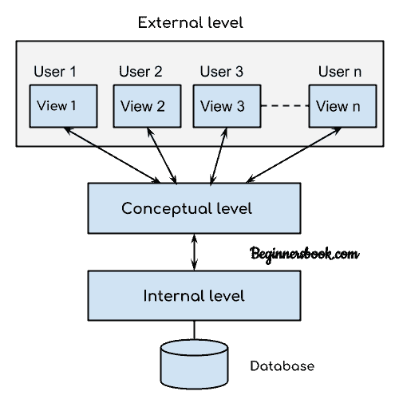

# DBMS - 三级架构

> 原文： [https://beginnersbook.com/2018/11/dbms-three-level-architecture/](https://beginnersbook.com/2018/11/dbms-three-level-architecture/)

在上一篇教程中，我们看到了 [DBMS 架构](https://beginnersbook.com/2018/11/dbms-architecture/) - 一层，两层和三层。在本指南中，我们将详细讨论三级 DBMS 体系结构。

## DBMS 三层架构图

该架构有三个级别：
1.外部级别
2.概念级别
3.内部级别

## 1.外部水平

它也被称为**视图级**。此级别称为“视图”的原因是因为多个用户可以在此级别查看所需数据，这些数据是在概念和内部级别映射的帮助下从数据库内部获取的。

用户不需要知道数据库架构细节，例如数据结构，表定义等。用户只关心从数据库中获取后返回到视图级别的数据（存在于内部级别） 。

外部级别是三级 DBMS 体系结构的“**顶级**”。

## 2.概念层面

它也被称为**逻辑电平**。数据库的整体设计，如数据之间的关系，数据模式等都在这个层次上进行了描述。

数据库约束和安全性也在此级别的体系结构中实现。此级别由 DBA（数据库管理员）维护。

## 3.内部水平

此级别也称为物理级别。此级别描述了数据实际存储在存储设备中的方式。此级别还负责为数据分配空间。这是架构的最低级别。