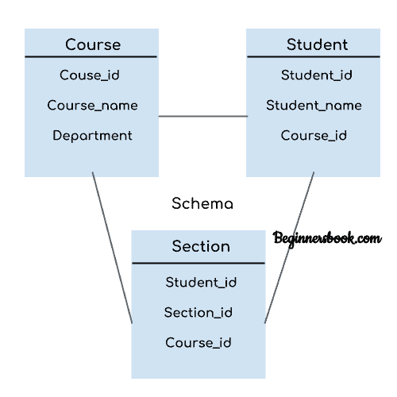

# DBMS 中的实例和架构

> 原文： [https://beginnersbook.com/2015/04/instance-and-schema-in-dbms/](https://beginnersbook.com/2015/04/instance-and-schema-in-dbms/)

在本指南中，我们将了解 DBMS 中的实例和模式。

## DBMS 架构

**模式的定义**：数据库的设计称为模式。架构有三种类型：物理架构，逻辑架构和视图架构。

例如：在下图中，我们有一个模式，显示三个表之间的关系：`Course`，`Student`和`Section`。该图仅显示数据库的设计，它不显示这些表中存在的数据。模式只是数据库的结构视图（设计），如下图所示。

物理层面的数据库设计称为**物理模式**，在此级别描述数据如何存储在存储块中。

逻辑层面数据库的设计称为**逻辑模式**，程序员和数据库管理员在这个级别工作，在这个级别数据可以描述为某些类型的数据记录，存储在数据结构中，但因为数据结构的实现，内部细节在此级别隐藏（在物理级别可用）。

视图级数据库的设计称为**视图模式**。这通常描述了最终用户与数据库系统的交互。

要了解有关这些模式的更多信息，请参阅 [3 级数据抽象](https://beginnersbook.com/2015/04/levels-of-abstraction-in-dbms/ "Data Abstraction in DBMS")。

## DBMS 实例

**实例的定义**：在特定时刻存储在数据库中的数据称为数据库实例。数据库模式定义属于特定数据库的表中的变量声明；这些变量在某个时刻的值称为该数据库的实例。

例如，假设我们在数据库中有一个表`Student`，今天该表有 100 条记录，所以今天数据库的实例有 100 条记录。假设我们明天将在此表中添加另外 100 条记录，因此明天数据库实例将在表中有 200 条记录。简而言之，在特定时刻，存储在数据库中的数据称为实例，当我们从数据库添加或删除数据时，该实例会随时间而变化。