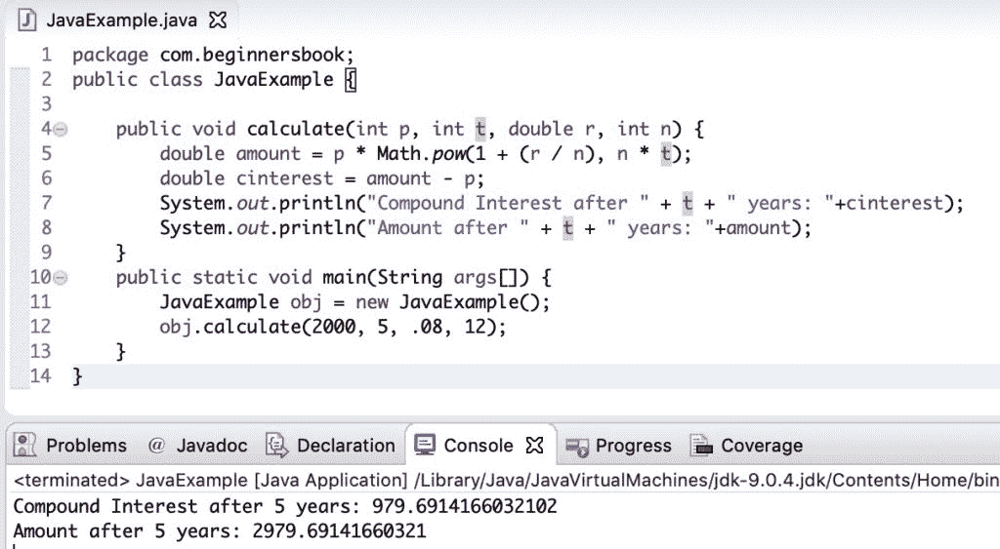

# Java 程序：计算复合利率

> 原文： [https://beginnersbook.com/2019/07/java-program-to-calculate-compound-interest/](https://beginnersbook.com/2019/07/java-program-to-calculate-compound-interest/)

在本教程中，我们将编写一个 **java 程序来计算复合利率**。

## 复利计算公式

使用以下公式计算复利：

```java
P (1 + R/n) (nt) - P
```

这里`P`是本金额。
`R`是年利率。
`t`是投资或借入资金的时间。
`n`是每单位 t 复利的次数，例如，如果利息按月复利而`t`为年，则 n 的值为 12。如果利息按季度复利，`t`是以年为单位，则`n`的值为 4。

**在编写 java 程序之前，我们以一个例子来计算复合利率。**

**假设 2000 美元的金额作为定期存款存入银行账户，年利率为 8%，每月复利，5 年后的复利将是：**

```java
P = 2000
R = 8/100 = 0.08（十进制）
n = 12
t = 5
```

我们将这些值放在公式中。

```java
复利 = 2000 (1 + 0.08 / 12) (12 * 5) - 2000 = $ 979.69
```

因此，5 年后的复利为 979.69 美元。

## 用于计算复合利率的 Java 程序

在这个 java 程序中，我们正在计算复合利率，我们正在考虑上面我们在计算中看到的**相同的例子**。

```java
public class JavaExample {

    public void calculate(int p, int t, double r, int n) {
        double amount = p * Math.pow(1 + (r / n), n * t);
        double cinterest = amount - p;
        System.out.println("Compound Interest after " + t + " years: "+cinterest);
        System.out.println("Amount after " + t + " years: "+amount);
    }
    public static void main(String args[]) {
    	JavaExample obj = new JavaExample();
    	obj.calculate(2000, 5, .08, 12);
    }
}
```

**输出：**

```java
Compound Interest after 5 years: 979.6914166032102
Amount after 5 years: 2979.69141660321

```

Eclipse IDE 的屏幕截图：



### 相关的 Java 示例

1.  [Java 程序：计算学生成绩](https://beginnersbook.com/2017/09/java-program-to-calculate-and-display-student-grades/)
2.  [Java 程序：使用数组计算平均值](https://beginnersbook.com/2017/09/java-program-to-calculate-average-using-array/)
3.  [Java 程序：计算圆的面积和周长](https://beginnersbook.com/2014/01/java-program-to-calculate-area-and-circumference-of-circle/)
4.  [Java 程序：计算三角形面积](https://beginnersbook.com/2014/01/java-program-to-calculate-area-of-triangle/)