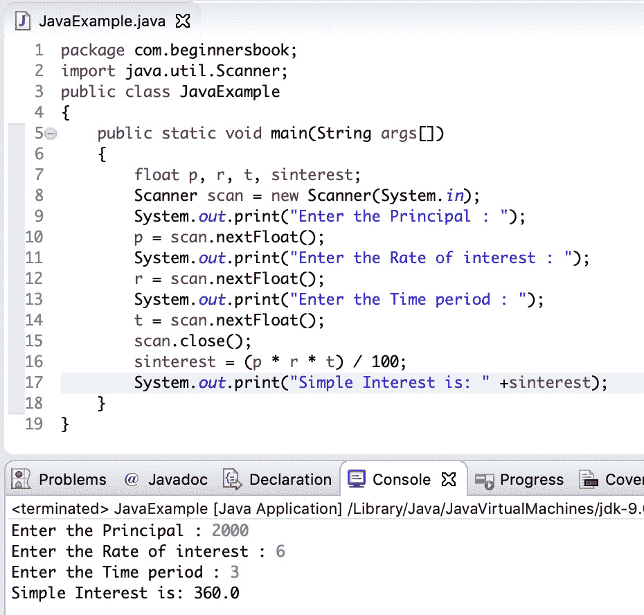

# 用于计算简单兴趣的 Java 程序

> 原文： [https://beginnersbook.com/2019/07/java-program-to-calculate-simple-interest/](https://beginnersbook.com/2019/07/java-program-to-calculate-simple-interest/)

在本教程中，我们将**编写一个 java 程序来计算简单的兴趣**。

要编写复合感兴趣的程序，请参考本指南：[程序来计算复合兴趣](https://beginnersbook.com/2019/07/java-program-to-calculate-compound-interest/)。

## 简单兴趣公式

```java
Simple Interest = (P × R × T)/100
```

**P** 是本金额。
**R** 是每年的费率。
**T** 是多年的时间。

**例如：** **假设一个人在银行账户中存入 2000 INR，年利率为 6%，为期 3 年，计算 3 年末的简单利息。**

简单兴趣= 2000 * 6 * 3/100 = 360 INR

## Java 程序计算简单的兴趣

在下面的例子中，我们从用户获取 p，r 和 t 的值，然后我们根据输入的值计算简单兴趣。

```java
import java.util.Scanner;
public class JavaExample
{
    public static void main(String args[]) 
    {
        float p, r, t, sinterest;
        Scanner scan = new Scanner(System.in);
        System.out.print("Enter the Principal : ");
        p = scan.nextFloat();
        System.out.print("Enter the Rate of interest : ");
        r = scan.nextFloat();
        System.out.print("Enter the Time period : ");
        t = scan.nextFloat();
        scan.close();
        sinterest = (p * r * t) / 100;
        System.out.print("Simple Interest is: " +sinterest);
    }
}
```

**输出：**

```java
Enter the Principal : 2000
Enter the Rate of interest : 6
Enter the Time period : 3
Simple Interest is: 360.0
```

Eclipse IDE 的屏幕截图：


### 相关的 Java 示例

1.  [Java 程序使用数组](https://beginnersbook.com/2017/09/java-program-to-calculate-average-using-array/)计算值的平均值
2.  [Java 程序计算平方面积](https://beginnersbook.com/2014/01/java-program-to-calculate-area-of-square/)
3.  [Java 程序打印备用素数](https://beginnersbook.com/2019/04/java-program-to-print-alternate-prime-numbers/)
4.  [Java 程序打印 pascal 三角形](https://beginnersbook.com/2019/02/java-program-to-print-pascal-triangle/)