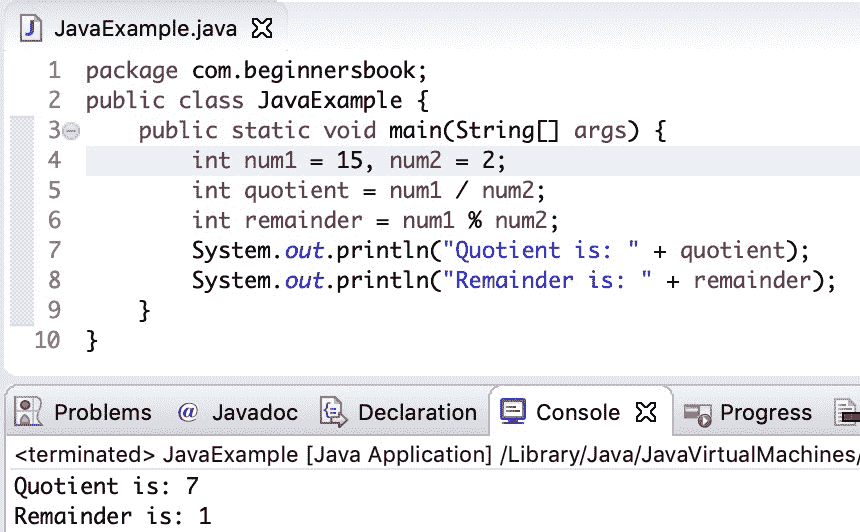

# Java 程序：查找商和余数

> 原文： [https://beginnersbook.com/2019/08/java-program-to-find-quotient-and-remainder/](https://beginnersbook.com/2019/08/java-program-to-find-quotient-and-remainder/)

在本文中，我们将编写一个 **Java 程序来查找商数和余数**，当一个数字除以另一个数字时。

## 示例：用于查找商和剩余的程序

在下面的程序中，我们有两个整数`num1`和`num2`，当`num1`除以`num2`时我们找到商和余数，所以我们可以说`num1`是**被除数**，而`num2`是**除数**。

```java
public class JavaExample {
    public static void main(String[] args) {
        int num1 = 15, num2 = 2;
        int quotient = num1 / num2;
        int remainder = num1 % num2;
        System.out.println("Quotient is: " + quotient);
        System.out.println("Remainder is: " + remainder);
    }
}
```

**输出：**



为**计算商和余数**，我们分别创建了两个名为`quotient`和`remainder`的变量。

为了找到**商**，我们使用`/`运算符将`num1`除以`num2`。由于变量`num1`和`num2`是整数，尽管`15/2`的结果在数学上是 7.5，但结果将是整数。因此，操作后分配给变量`quotient`的值为 7。

要找到**余数**，我们使用`%`运算符。操作后，将`15/2`的余数（即 1）分配给变量`remainder`。

在程序结束时，打印变量`quotient`和`remainder`的值。

#### 相关的 Java 示例

1\. [Java 程序：计算简单兴趣](https://beginnersbook.com/2019/07/java-program-to-calculate-simple-interest/)
2\. [Java 程序：进行选择排序](https://beginnersbook.com/2019/04/java-program-for-selection-sorting/)
3\. [Java 程序：打印备用素数](https://beginnersbook.com/2019/04/java-program-to-print-alternate-prime-numbers/)
4\. [Java 程序：计算字符串中出现的字符](https://beginnersbook.com/2019/04/java-program-to-find-the-occurrence-of-a-character-in-a-string/)
5\. [Java 程序：将整数分解为数字](https://beginnersbook.com/2019/02/java-program-to-break-integer-into-digits/)