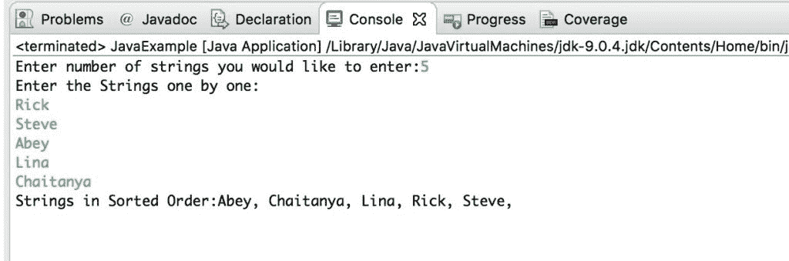

# Java 程序：按字母顺序排序字符串

> 原文： [https://beginnersbook.com/2018/10/java-program-to-sort-strings-in-an-alphabetical-order/](https://beginnersbook.com/2018/10/java-program-to-sort-strings-in-an-alphabetical-order/)

在这个 [java 教程](https://beginnersbook.com/java-tutorial-for-beginners-with-examples/)中，我们将学习如何按字母顺序对字符串进行排序。

## Java 示例：按字母顺序排列字符串

在这个程序中，我们要求用户输入他想要输入的字符串计数以进行排序。一旦使用`Scanner`类捕获计数，我们已初始化输入计数大小的`String`数组，然后运行[`for`循环](https://beginnersbook.com/2015/03/for-loop-in-java-with-example/)以捕获用户输入的所有字符串。

一旦我们将所有字符串存储在字符串数组中，我们就会比较每个字符串的第一个字母，以便按字母顺序对它们进行排序。

```java
import java.util.Scanner;
public class JavaExample
{
    public static void main(String[] args) 
    {
        int count;
        String temp;
        Scanner scan = new Scanner(System.in);

        //User will be asked to enter the count of strings 
        System.out.print("Enter number of strings you would like to enter:");
        count = scan.nextInt();

        String str[] = new String[count];
        Scanner scan2 = new Scanner(System.in);

        //User is entering the strings and they are stored in an array
        System.out.println("Enter the Strings one by one:");
        for(int i = 0; i < count; i++)
        {
            str[i] = scan2.nextLine();
        }
        scan.close();
        scan2.close();

        //Sorting the strings
        for (int i = 0; i < count; i++) 
        {
            for (int j = i + 1; j < count; j++) { 
                if (str[i].compareTo(str[j])>0) 
                {
                    temp = str[i];
                    str[i] = str[j];
                    str[j] = temp;
                }
            }
        }

        //Displaying the strings after sorting them based on alphabetical order
        System.out.print("Strings in Sorted Order:");
        for (int i = 0; i <= count - 1; i++) 
        {
            System.out.print(str[i] + ", ");
        }
    }
}
```

输出：



**相关 Java 示例：**

1.  [Java 程序：在字符串中反转单词](https://beginnersbook.com/2017/09/java-program-to-reverse-words-in-a-string/)
2.  [Java 程序：计算和打印学生成绩](https://beginnersbook.com/2017/09/java-program-to-calculate-and-display-student-grades/)
3.  [Java 程序：使用递归反转字符串](https://beginnersbook.com/2017/09/java-program-to-reverse-a-string-using-recursion/)
4.  [Java 程序：查找字符串中的重复字符](https://beginnersbook.com/2014/07/java-program-to-find-duplicate-characters-in-a-string/)