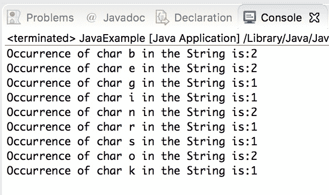

# Java 程序：查找字符串中字符的出现

> 原文： [https://beginnersbook.com/2019/04/java-program-to-find-the-occurrence-of-a-character-in-a-string/](https://beginnersbook.com/2019/04/java-program-to-find-the-occurrence-of-a-character-in-a-string/)

在本教程中，我们将编写一个 Java 程序来查找`String`中字符的出现。

## 编程以查找字符串中字符的出现

在这个程序中，我们发现`String`中每个字符的出现。为此，我们首先创建一个大小为 256（ASCII 上限）的数组，这里的想法是将出现次数存储在该字符的 ASCII 值中。例如，`'A'`的出现将存储在计数器[65]中，因为`A`的 ASCII 值是 65，类似地，其他字符的出现存储在它们的 ASCII 索引值中。

然后我们创建另一个数组`array`来保存给定`String`的字符，然后我们将它们与`String`中的字符进行比较，当找到匹配时，使用`counter`数组显示该特定字符的计数。

```java
class JavaExample {  

   static void countEachChar(String str) 
   { 
	//ASCII values ranges upto 256
	int counter[] = new int[256]; 

	//String length
	int len = str.length(); 

	/* This array holds the occurrence of each char, For example
	 * ASCII value of A is 65 so if A is found twice then 
	 * counter[65] would have the value 2, here 65 is the ASCII value
	 * of A
	 */
	for (int i = 0; i < len; i++) 
		counter[str.charAt(i)]++; 

	// We are creating another array with the size of String
	char array[] = new char[str.length()]; 
        for (int i = 0; i < len; i++) { 
	   array[i] = str.charAt(i); 
	   int flag = 0; 
	   for (int j = 0; j <= i; j++) { 

		/* If a char is found in String then set the flag 
		 * so that we can print the occurrence
		 */
		if (str.charAt(i) == array[j])  
			flag++;                 
	   } 

	   if (flag == 1)  
	      System.out.println("Occurrence of char " + str.charAt(i)
		 + " in the String is:" + counter[str.charAt(i)]);             
	} 
   } 
   public static void main(String[] args) 
   {  
	String str = "beginnersbook"; 
	countEachChar(str); 
   } 
}
```

**输出：**



#### 相关的 Java 程序

1\. [Java 程序：按字母顺序排序字符串](https://beginnersbook.com/2018/10/java-program-to-sort-strings-in-an-alphabetical-order/)
2\. [Java 程序：检查元音和辅音](https://beginnersbook.com/2017/09/java-program-to-check-vowel-and-consonant-using-switch-case/)
3\. [Java 程序：查找字符串中的重复字符](https://beginnersbook.com/2014/07/java-program-to-find-duplicate-characters-in-a-string/)
4\. [Java 程序：检查回文串](https://beginnersbook.com/2014/01/java-program-to-check-palindrome-string-using-recursion/)