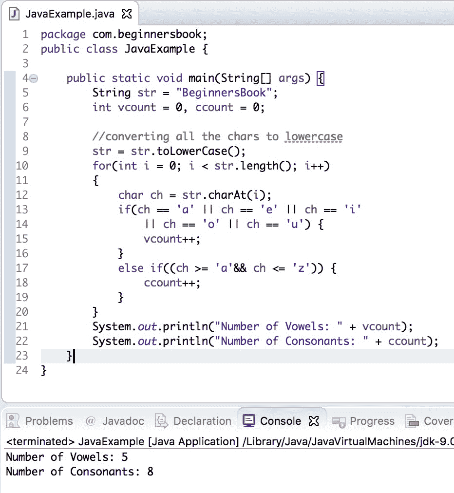

# 用于计算字符串中的元音和辅音的 Java 程序

> 原文： [https://beginnersbook.com/2019/04/java-program-to-count-vowels-and-consonants-in-a-string/](https://beginnersbook.com/2019/04/java-program-to-count-vowels-and-consonants-in-a-string/)

在本文中，我们将编写一个 Java 程序来计算 String 中的元音和辅音。

## 用于计算给定字符串中的元音和辅音的程序

这里我们有两个变量`vcount`和`ccount`来分别保持元音和辅音的数量。我们已经使用 [toLowerCase（）方法](https://beginnersbook.com/2013/12/java-string-tolowercase-method-example/)将字符串的每个字符串转换为小写，以便于比较。

然后我们使用 [charAt（）方法](https://beginnersbook.com/2013/12/java-string-charat-method-example/)和 [if..else 将字符串的每个字符串与元音'a'，'e'，'i'，'o'，'u'进行比较。 .if 语句](https://beginnersbook.com/2017/08/if-else-statement-in-java/)，如果找到匹配，那么我们正在增加元音计数器`vcount`，否则我们正在增加辅音计数器`ccount`。

```java
public class JavaExample {

    public static void main(String[] args) {
        String str = "BeginnersBook";
        int vcount = 0, ccount = 0;

        //converting all the chars to lowercase
        str = str.toLowerCase();
        for(int i = 0; i < str.length(); i++) { char ch = str.charAt(i); if(ch == 'a' || ch == 'e' || ch == 'i' || ch == 'o' || ch == 'u') { vcount++; } else if((ch >= 'a'&& ch <= 'z')) {
                ccount++;
            }
        }
        System.out.println("Number of Vowels: " + vcount);
        System.out.println("Number of Consonants: " + ccount);
    }
}
```

**输出：**



#### 相关的 Java 程序

1\. [Java 程序在字符串](https://beginnersbook.com/2019/04/java-program-to-find-the-occurrence-of-a-character-in-a-string/)
中查找字符的出现 2\. [Java 程序对字符串执行冒泡排序](https://beginnersbook.com/2019/04/java-program-to-perform-bubble-sort-on-strings/)
3\. [Java 程序到反转一个字符串](https://beginnersbook.com/2017/09/java-program-to-reverse-a-string-using-recursion/)
4\. [使用 Switch Case 检查元音或辅音的 Java 程序](https://beginnersbook.com/2017/09/java-program-to-check-vowel-and-consonant-using-switch-case/)