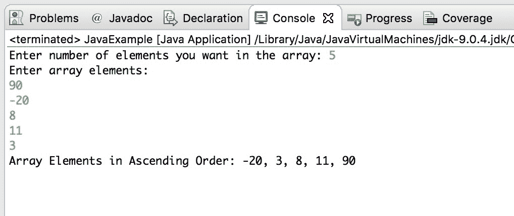

# 用于按升序排序数组的 Java 程序

> 原文： [https://beginnersbook.com/2018/10/java-program-to-sort-an-array-in-ascending-order/](https://beginnersbook.com/2018/10/java-program-to-sort-an-array-in-ascending-order/)

在这个 java [教程](https://beginnersbook.com/java-tutorial-for-beginners-with-examples/)中，我们使用临时变量和嵌套 for 循环按升序对数组进行排序。我们使用 Scanner 类来获取用户的输入。

## Java 示例：按升序排序数组的程序

在该程序中，要求用户输入他想要输入的元素的数量。根据输入，我们声明了一个 int 数组，然后我们接受用户输入的所有[数字并将它们存储在数组中。](https://beginnersbook.com/2014/07/java-program-to-get-input-from-user/)

一旦我们将所有数字存储在数组中，我们就会使用[嵌套 for 循环](https://beginnersbook.com/2015/03/for-loop-in-java-with-example/)对它们进行排序。

```java
import java.util.Scanner;
public class JavaExample 
{
    public static void main(String[] args) 
    {
    	int count, temp;

    	//User inputs the array size
        Scanner scan = new Scanner(System.in);
        System.out.print("Enter number of elements you want in the array: ");
        count = scan.nextInt();

        int num[] = new int[count];
        System.out.println("Enter array elements:");
        for (int i = 0; i < count; i++) 
        {
            num[i] = scan.nextInt();
        }
        scan.close();
        for (int i = 0; i < count; i++) 
        {
            for (int j = i + 1; j < count; j++) { 
                if (num[i] > num[j]) 
                {
                    temp = num[i];
                    num[i] = num[j];
                    num[j] = temp;
                }
            }
        }
        System.out.print("Array Elements in Ascending Order: ");
        for (int i = 0; i < count - 1; i++) 
        {
            System.out.print(num[i] + ", ");
        }
        System.out.print(num[count - 1]);
    }
}
```

输出：



**相关 Java 示例：**

1\. [Java 程序按升序和降序排序](https://beginnersbook.com/2014/07/java-program-for-bubble-sort-in-ascending-descending-order/)
2\. [Java 程序使用按位 xor 运算符交换两个数字[](https://beginnersbook.com/2017/09/java-program-to-swap-two-numbers-using-bitwise-xor-operator/)
3\. [Java 程序按字母顺序排序字符串](https://beginnersbook.com/2018/10/java-program-to-sort-strings-in-an-alphabetical-order/)
4\. [Java 程序反转数组](https://beginnersbook.com/2017/09/java-program-to-reverse-the-array/)