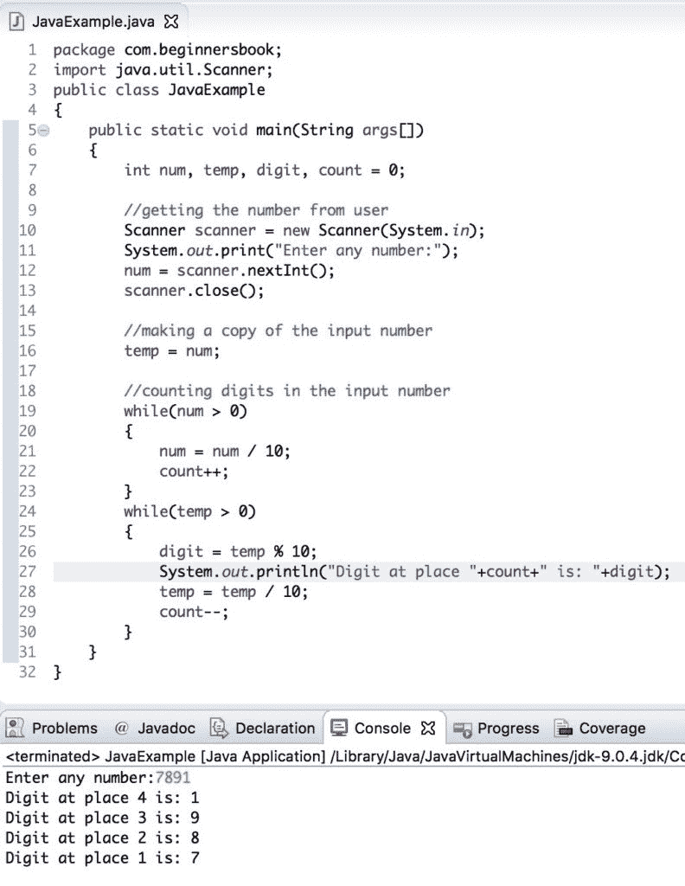

# Java 程序：将`Integer`分解为数字

> 原文： [https://beginnersbook.com/2019/02/java-program-to-break-integer-into-digits/](https://beginnersbook.com/2019/02/java-program-to-break-integer-into-digits/)

在本教程中，我们将编写一个 java 程序来将输入整数分成数字。例如，如果输入的数字是 912，则程序应显示数字 2,1,9 以及它们在输出中的位置。

## Java 将整数分成数字的示例

这里我们使用 Scanner 类来[从用户](https://beginnersbook.com/2014/07/java-program-to-get-input-from-user/)获取输入。在第一个 [while 循环](https://beginnersbook.com/2015/03/while-loop-in-java-with-examples/)中，我们计算输入数字中的数字，然后在第二个 while 循环中，我们使用[模数运算符](https://beginnersbook.com/2017/08/operators-in-java/)从输入数字中提取数字。

```java
package com.beginnersbook;
import java.util.Scanner;
public class JavaExample 
{
    public static void main(String args[])
    {
        int num, temp, digit, count = 0;

        //getting the number from user
        Scanner scanner = new Scanner(System.in);
        System.out.print("Enter any number:");
        num = scanner.nextInt();
        scanner.close();

        //making a copy of the input number
        temp = num;

        //counting digits in the input number
        while(num > 0)
        {
            num = num / 10;
            count++;
        }
        while(temp > 0)
        {
            digit = temp % 10;
            System.out.println("Digit at place "+count+" is: "+digit);
            temp = temp / 10;
            count--;
        }
    }
}
```

**输出：**

