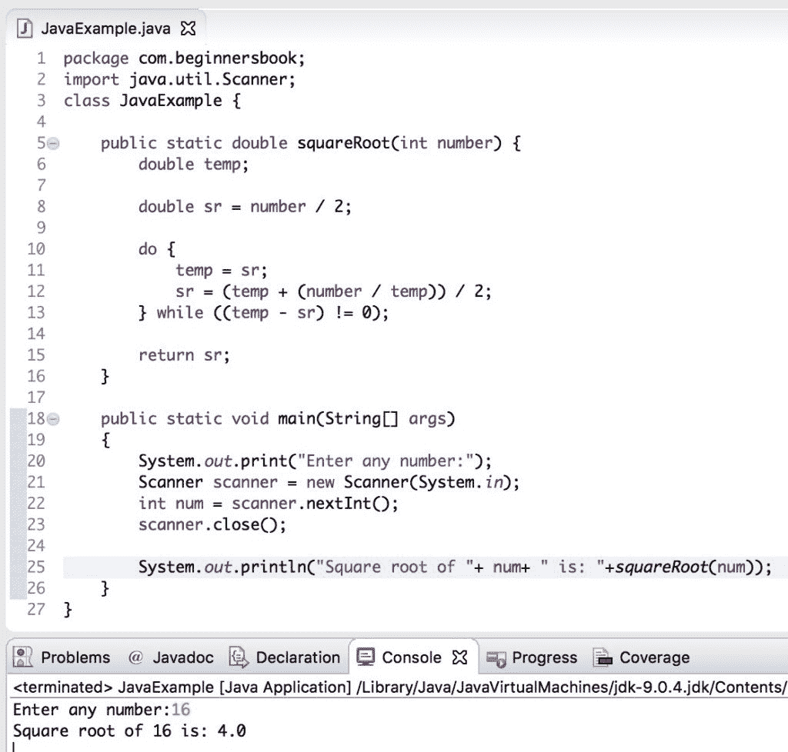

# Java 程序：不使用`sqrt`查找数字的平方根

> 原文： [https://beginnersbook.com/2019/02/java-program-to-find-square-root-of-a-number-without-sqrt/](https://beginnersbook.com/2019/02/java-program-to-find-square-root-of-a-number-without-sqrt/)

找到数字的平方根非常容易，我们可以使用`Math.sqrt()`方法找出任​​意数字的平方根。但是在本教程中我们将做一些不同的事情，我们将编写一个 java 程序来找到没有`sqrt()`方法的数字的**平方根**。

## Java 示例：不使用`sqrt()`方法查找平方根

在下面的程序中，我们创建了一个方法`squareRoot()`，在方法中我们编写了一个方程式，用于查找数字的平方根。对于方程式，我们使用[`while`循环](https://beginnersbook.com/2015/03/do-while-loop-in-java-with-example/)。

```java
package com.beginnersbook;
import java.util.Scanner;
class JavaExample { 

    public static double squareRoot(int number) {
	double temp;

	double sr = number / 2;

	do {
		temp = sr;
		sr = (temp + (number / temp)) / 2;
	} while ((temp - sr) != 0);

	return sr;
    }

    public static void main(String[] args)  
    { 
	System.out.print("Enter any number:");
	Scanner scanner = new Scanner(System.in);
	int num = scanner.nextInt(); 
	scanner.close();

	System.out.println("Square root of "+ num+ " is: "+squareRoot(num));
    } 
}
```

**输出：**



#### 相关的 Java 示例

1.  [Java 程序：检查完美平方数](https://beginnersbook.com/2019/02/java-program-to-check-if-given-number-is-perfect-square/)
2.  [Java 程序：打破数字](https://beginnersbook.com/2019/02/java-program-to-break-integer-into-digits/)
3.  [Java 程序：查找两个数字的 GCD](https://beginnersbook.com/2018/09/java-program-to-find-gcd-of-two-numbers/)
4.  [Java 程序：显示斐波那契序列](https://beginnersbook.com/2017/09/java-program-to-display-fibonacci-series-using-loops/)