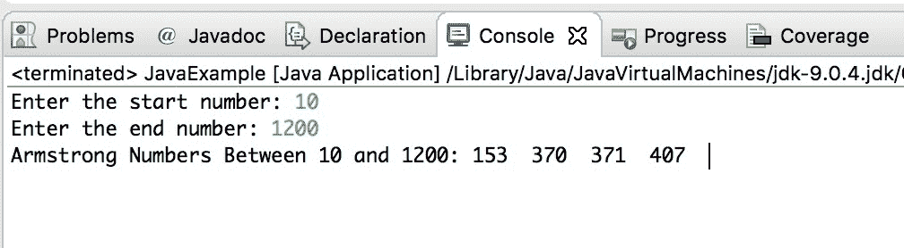

# Java 程序：在给定范围之间打印 Armstrong 数字

> 原文： [https://beginnersbook.com/2019/02/java-program-to-print-armstrong-numbers-between-a-given-range/](https://beginnersbook.com/2019/02/java-program-to-print-armstrong-numbers-between-a-given-range/)

我们已经看过 java [程序来检查 Armstrong 号码](https://beginnersbook.com/2017/09/java-program-to-check-armstrong-number/)。在本教程中，我们将编写一个 java 程序来打印给定范围之间的 Armstrong 数字。

## Java 示例在给定范围之间打印 Armstrong 数字

在此程序中，要求用户输入起始和结束编号，程序然后在这些[输入编号](https://beginnersbook.com/2014/07/java-program-to-get-input-from-user/)之间打印阿姆斯壮编号。

```java
package com.beginnersbook;
import java.util.Scanner;

public class JavaExample
{
    public static void main(String args[])
    {
	int num, start, end, i, rem, temp, counter=0;

	Scanner scanner = new Scanner(System.in);
	System.out.print("Enter the start number: ");
	start = scanner.nextInt();
	System.out.print("Enter the end number: ");
	end = scanner.nextInt();
	scanner.close();

	//generate Armstrong numbers between start and end
	for(i=start+1; i<end; i++)
	{
	   temp = i;
	   num = 0;
	   while(temp != 0)
	   {
		rem = temp%10;
		num = num + rem*rem*rem;
		temp = temp/10;
	   }
	   if(i == num)
	   {
		if(counter == 0)
		{
		   System.out.print("Armstrong Numbers Between "+start+" and "+end+": ");
		}
		   System.out.print(i + "  ");
		   counter++;
	   }
	}
	// if no Armstrong number is found
	if(counter == 0)
	{
	   System.out.print("There is no Armstrong number Between "+start+" and "+end);
	}
    }
}
```

**输出：**



#### 相关的 Java 示例

1\. [Java 程序打印 Pascal 的三角形](https://beginnersbook.com/2019/02/java-program-to-print-pascal-triangle/)
2\. [Java 程序将整数分解为数字](https://beginnersbook.com/2019/02/java-program-to-break-integer-into-digits/)
3\. [Java 程序打印给定范围之间的素数](https://beginnersbook.com/2014/01/java-program-to-display-prime-numbers/)
4\. [Java 程序生成随机数](https://beginnersbook.com/2014/04/java-program-to-generate-random-number-example/)