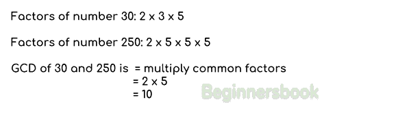

# Java 程序：查找两个数字的 GCD

> 原文： [https://beginnersbook.com/2018/09/java-program-to-find-gcd-of-two-numbers/](https://beginnersbook.com/2018/09/java-program-to-find-gcd-of-two-numbers/)

两个数字的 **GCD（最大公约数）**是最大的正整数，它将两个数字整除而不留任何余数。例如。 30 和 45 的 GCD 是 15。GCD 也称为 HCF（最高公因子）。在[教程](https://beginnersbook.com/java-tutorial-for-beginners-with-examples/)中，我们将编写几个不同的 [Java 程序](https://beginnersbook.com/2017/09/java-examples/)来找出两个数字的 GCD。

## 如何在纸上找出 GCD？

为了找出两个数字的 GCD，我们将公因子乘以如下图所示：



## 示例 1：Java 程序使用`for`循环查找两个数字的 GCD

在这个例子中，我们使用[`for`循环](https://beginnersbook.com/2015/03/for-loop-in-java-with-example/)找到两个给定数字的 GCD。

我们正在运行一个 for 循环，从 1 到较小的数字和内部循环，我们将这两个数字除以循环计数器`i`，范围从 1 到较小的数字值。如果`i`的值除以两个数字而没有余数，那么我们将该值赋给变量`gcd`。在循环结束时，变量`gcd`将具有最大数字，该数字除以两个数字而没有余数。

```java
public class GCDExample1 {

    public static void main(String[] args) {

    	//Lets take two numbers 55 and 121 and find their GCD
        int num1 = 55, num2 = 121, gcd = 1;

        /* loop is running from 1 to the smallest of both numbers
         * In this example the loop will run from 1 to 55 because 55
         * is the smaller number. All the numbers from 1 to 55 will be 
         * checked. A number that perfectly divides both numbers would
         * be stored in variable "gcd". By doing this, at the end, the 
         * variable gcd will have the largest number that divides both
         * numbers without remainder.
         */
        for(int i = 1; i <= num1 && i <= num2; i++)
        {
            if(num1%i==0 && num2%i==0)
                gcd = i;
        }

        System.out.printf("GCD of %d and %d is: %d", num1, num2, gcd);
    }

}
```

输出：

```java
GCD of 55 and 121 is: 11
```

## 示例 2：使用`while`循环查找两个数字的 GCD

让我们使用[`while`循环](https://beginnersbook.com/2015/03/while-loop-in-java-with-examples/)编写相同的程序。在这里，我们采用不同的方法来寻找 gcd。在这个程序中，我们从较大的数字中减去较小的数字，直到它们变得相同。在循环结束时，数字的值将相同，并且该值将是这些数字的 GCD。

```java
public class GCDExample2 {

    public static void main(String[] args) {

        int num1 = 55, num2 = 121;

        while (num1 != num2) {
        	if(num1 > num2)
                num1 = num1 - num2;
            else
                num2 = num2 - num1;
        }

        System.out.printf("GCD of given numbers is: %d", num2);
    }

}
```

输出：

```java
GCD of given numbers is: 11
```

## 示例 3：查找两个输入（由用户输入）数字的 GCD

在这个例子中，我们使用`Scanner`来[从用户](https://beginnersbook.com/2014/07/java-program-to-get-input-from-user/)获取输入。用户将输入两个数字的值，程序将找到这些输入数字的 GCD。

```java
import java.util.Scanner;
public class GCDExample3 {

    public static void main(String[] args) {

        int num1, num2;

        //Reading the input numbers
        Scanner scanner = new Scanner(System.in);
        System.out.print("Enter first number:");
        num1 = (int)scanner.nextInt();

        System.out.print("Enter second number:");
        num2 = (int)scanner.nextInt();

        //closing the scanner to avoid memory leaks
        scanner.close();
        while (num1 != num2) {
        	if(num1 > num2)
                num1 = num1 - num2;
            else
                num2 = num2 - num1;
        }

        //displaying the result
        System.out.printf("GCD of given numbers is: %d", num2);
    }

}
```

输出：

```java
Enter first number:30
Enter second number:250
GCD of given numbers is: 10
```

下面是几个相关的 java 例子：

1\. [Java 程序：找到 factorial 数](https://beginnersbook.com/2017/09/java-program-to-find-factorial-using-for-and-while-loop/)
2\. [Java 程序：显示 Fibonacci 系列](https://beginnersbook.com/2017/09/java-program-to-display-fibonacci-series-using-loops/)
3\. [Java 程序：找到三个数字中最大的数字](https://beginnersbook.com/2017/09/java-program-to-find-largest-of-three-numbers/)