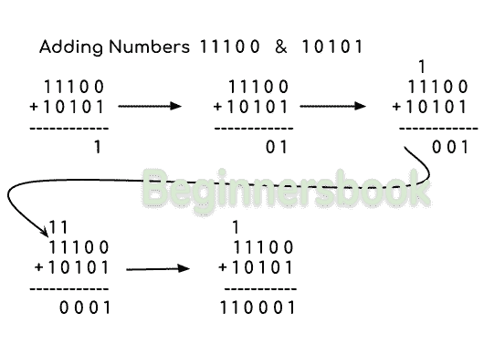
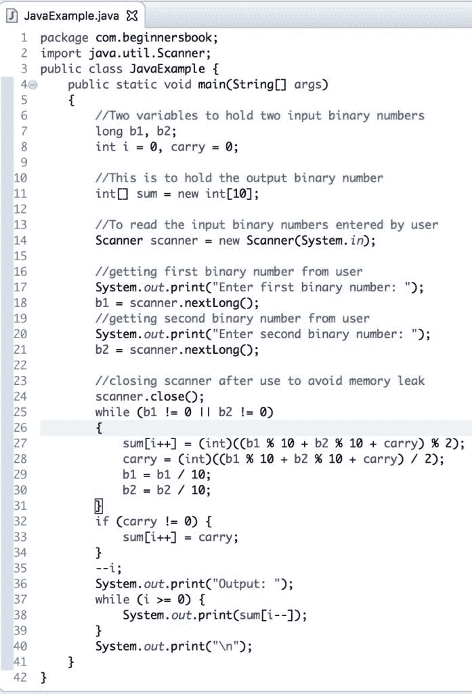
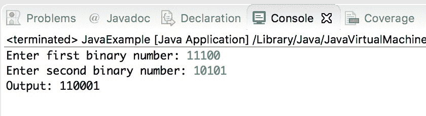

# Java 程序添加两个二进制数

> 原文： [https://beginnersbook.com/2018/09/java-program-to-add-two-binary-numbers/](https://beginnersbook.com/2018/09/java-program-to-add-two-binary-numbers/)

在本教程中，我们将 [java 程序](https://beginnersbook.com/2017/09/java-examples/)编写为[添加两个二进制数](https://beginnersbook.com/2018/03/python-program-to-add-two-binary-numbers/)。二进制数系统只有两个符号 0&amp; 1 所以二进制数只包含 0 和 1。在我们编写添加程序之前，让我们看看我们如何在纸上添加，如下图所示：



## 示例：在 Java 中添加二进制数

在这个程序中，我们使用 Scanner 从用户获取[输入（用户输入我们需要添加的两个二进制数），然后我们使用](https://beginnersbook.com/2014/07/java-program-to-get-input-from-user/)[逐位添加它们，而循环](https://beginnersbook.com/2015/03/while-loop-in-java-with-examples/)并将结果存储在一个数组中。

```java
import java.util.Scanner;
public class JavaExample {
   public static void main(String[] args)
   {
	//Two variables to hold two input binary numbers	 
	long b1, b2;
	int i = 0, carry = 0;

	//This is to hold the output binary number
	int[] sum = new int[10];

	//To read the input binary numbers entered by user
	Scanner scanner = new Scanner(System.in);

	//getting first binary number from user
	System.out.print("Enter first binary number: ");
	b1 = scanner.nextLong();
	//getting second binary number from user
	System.out.print("Enter second binary number: ");
	b2 = scanner.nextLong();

	//closing scanner after use to avoid memory leak
	scanner.close();
	while (b1 != 0 || b2 != 0) 
	{
		sum[i++] = (int)((b1 % 10 + b2 % 10 + carry) % 2);
		carry = (int)((b1 % 10 + b2 % 10 + carry) / 2);
		b1 = b1 / 10;
		b2 = b2 / 10;
	}
	if (carry != 0) {
		sum[i++] = carry;
	}
	--i;
	System.out.print("Output: ");
	while (i >= 0) {
		System.out.print(sum[i--]);
	}
	System.out.print("\n");  
   }
}
```

输出：

```java
Enter first binary number: 11100
Enter second binary number: 10101
Output: 110001

```

Eclipse IDE 中的相同程序：



Eclipse 中程序的输出：



以下是一些相关的 java 示例：

1.  [Java 程序添加两个复数](https://beginnersbook.com/2018/09/java-program-to-add-two-complex-numbers/)
2.  [Java 程序添加两个数字](https://beginnersbook.com/2017/09/java-program-to-add-two-numbers/)
3.  [Java 程序添加数字的数字](https://beginnersbook.com/2018/06/python-program-add-digits-number/)