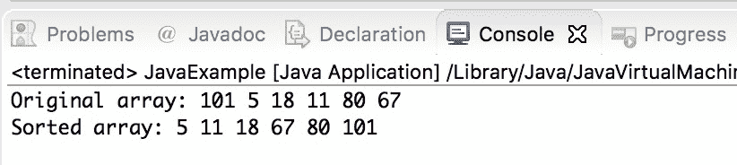

# Java 程序：选择排序

> 原文： [https://beginnersbook.com/2019/04/java-program-for-selection-sorting/](https://beginnersbook.com/2019/04/java-program-for-selection-sorting/)

在本教程中，我们将为**选择排序**编写一个 Java 程序。

## 选择排序算法如何工作？

**选择排序算法**的工作原理是将原始数组分成两个子数组：排序子数组和未排序子数组，最初排序的子数组为空。该算法通过从未排序的子数组中重复查找最小元素并将其替换为数组的第一个元素来工作，从而使该数组的一部分成为已排序的子数组。这种情况反复发生，直到整个数组被排序。

## Java 程序在 Array 上执行 Selection Sort

在下面的示例中，我们定义了一个实现选择排序算法的方法`selectionSort()`。它从数组中找到最小元素，并将其与数组的第一个元素交换。

我们创建了另一种方法`printArr()`来显示数组的元素。我们在排序之前和之后调用此方法，以在选择排序之前和之后显示数组元素。

```java
class JavaExample
{
    void selectionSort(int arr[])
    {
        int len = arr.length;

        for (int i = 0; i < len-1; i++)
        {
            // Finding the minimum element in the unsorted part of array
            int min = i;
            for (int j = i+1; j < len; j++)
                if (arr[j] < arr[min])
                    min = j;

            /* Swapping the found minimum element with the first
             * element of the sorted subarray using temp variable
             */
            int temp = arr[min];
            arr[min] = arr[i];
            arr[i] = temp;
        }
    }

    // Displays the array elements
    void printArr(int arr[])
    {
        for (int i=0; i<arr.length; i++)
            System.out.print(arr[i]+" ");
        System.out.println();
    }

    public static void main(String args[])
    {
        JavaExample obj = new JavaExample();
        int numarr[] = {101,5,18,11,80, 67};

        System.out.print("Original array: ");
        obj.printArr(numarr);

        //calling method for selection sorting
        obj.selectionSort(numarr);

        System.out.print("Sorted array: ");
        obj.printArr(numarr);
    }
}
```

**输出：**



#### 相关的 Java 示例

1\. [Java 程序对字符串执行冒泡](https://beginnersbook.com/2019/04/java-program-to-perform-bubble-sort-on-strings/)
2\. [Java 程序按升序对数组进行排序](https://beginnersbook.com/2018/10/java-program-to-sort-an-array-in-ascending-order/)
3\. [Java 程序用于冒泡排序升序和降序](https://beginnersbook.com/2014/07/java-program-for-bubble-sort-in-ascending-descending-order/)
4\. [用于二进制搜索的 Java 程序](https://beginnersbook.com/2014/04/java-program-to-perform-binary-search/)
5\. [用于线性搜索的 Java 程序](https://beginnersbook.com/2014/04/java-program-for-linear-search-example/)