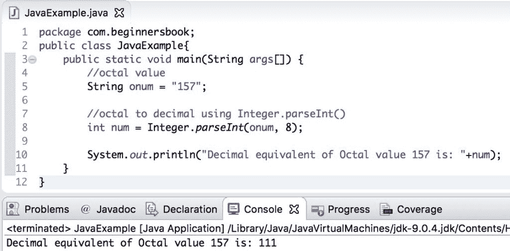

# Java 程序：八进制到十进制的转换

> 原文： [https://beginnersbook.com/2019/04/java-octal-to-decimal-conversion/](https://beginnersbook.com/2019/04/java-octal-to-decimal-conversion/)

在本文中，我们将看到如何在 Java 中借助示例将**八进制转换为十进制。**

我们可以通过两种方式将八进制值转换为等效的十进制值：
1.使用`Integer.parseInt()`方法并将基数传递为 8。
2.编写我们自己的自定义方法（逻辑）进行转换八进制到十进制。

## 1.使用`Integer.parseInt()`进行 Java 八进制到十进制转换

在下面的示例中，我们将八进制值存储在字符串变量`onum`中，并使用`Integer.parseInt()`方法将其转换为十进制值。此方法接受`String`作为参数，并根据作为参数提供的基本值将其转换为十进制值。

在`Integer.parseInt()`方法中，我们将**基数传递为 8**，因为八进制数的基值是 8。如果你记得[十六进制到十进制转换](https://beginnersbook.com/2019/04/java-hexadecimal-to-decimal-conversion/)，我们有传递基数为 16 进行转换。

```java
public class JavaExample{    
   public static void main(String args[]) {
	//octal value
	String onum = "157";

	//octal to decimal using Integer.parseInt()
	int num = Integer.parseInt(onum, 8);

	System.out.println("Decimal equivalent of Octal value 157 is: "+num);
   }
}
```

**输出：**



在上面的例子中，我们对八进制值进行了硬编码，但是如果你想[从用户获得](https://beginnersbook.com/2014/07/java-program-to-get-input-from-user/)八进制值，那么你可以像这样编写逻辑：

```java
import java.util.Scanner;
public class JavaExample{    
   public static void main(String args[]) {
	//octal value
	Scanner scanner = new Scanner(System.in);
	System.out.print("Enter Octal value: ");
	String onum = scanner.nextLine();
	scanner.close();

	//octal to decimal using Integer.parseInt()
	int num = Integer.parseInt(onum, 8);

	System.out.println("Decimal equivalent of value "+onum+" is: "+num);
   }
}
```

**输出：**

```java
Enter Octal value: 142
Decimal equivalent of value 142 is: 98
```

## 2\. Java 通过编写自定义代码将八进制转换为十进制

在上面的例子中，我们使用`Integer.parseInt()`方法进行转换，但是我们可以编写自己的逻辑将八进制值转换为等效的十进制值。让我们编写代码：这里我们使用了[`while`循环](https://beginnersbook.com/2015/03/while-loop-in-java-with-examples/)和[`if..else`语句](https://beginnersbook.com/2017/08/if-else-statement-in-java/)。

```java
public class JavaExample{  
   public static int octalToDecimal(int onum){    
	//initializing the decimal number as zero 
	int num = 0;    
	//This value will be used as the power  
	int p = 0;      
	while(true){    
	   if(onum == 0){    
		break;    
	   } else {    
		int temp = onum%10;    
		num += temp*Math.pow(8, p);    
		onum = onum/10;    
		p++;    
	   }    
	}    
	return num;    
   }    
   public static void main(String args[]){        
	System.out.println("Decimal equivalent of octal value 143: "+octalToDecimal(143));       
   }
}
```

**输出：**


