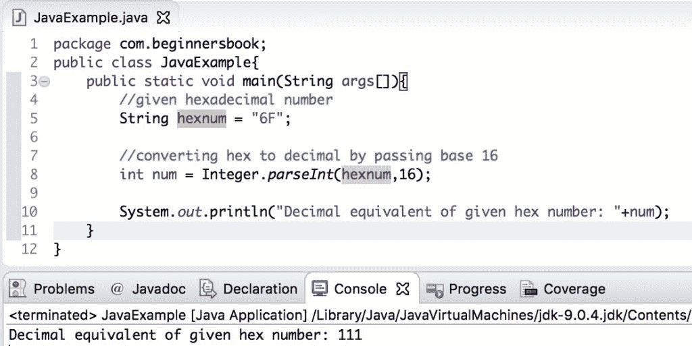
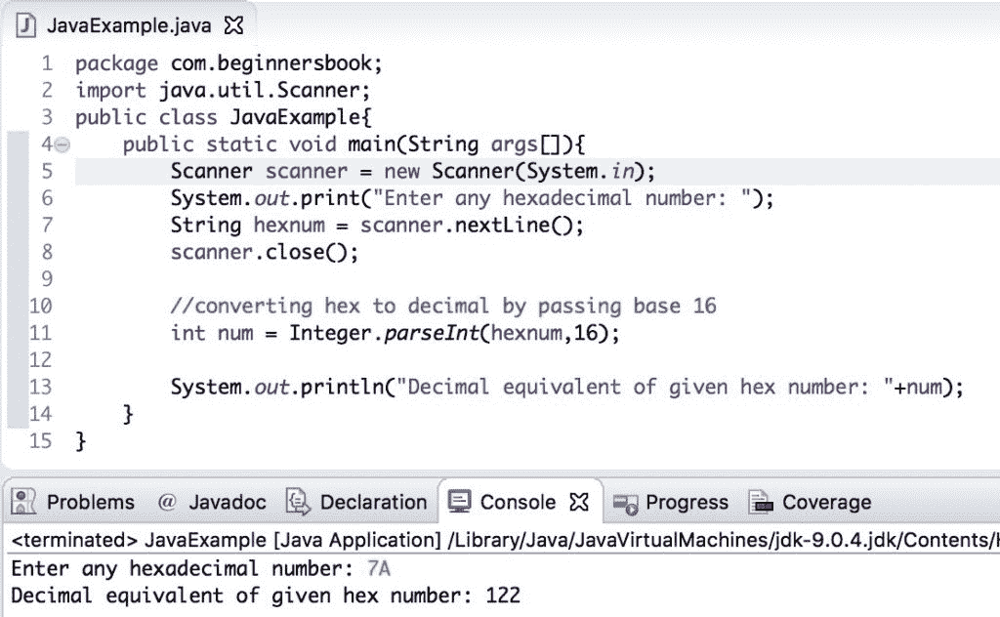

# Java 程序：十六进制到十进制的转换

> 原文： [https://beginnersbook.com/2019/04/java-hexadecimal-to-decimal-conversion/](https://beginnersbook.com/2019/04/java-hexadecimal-to-decimal-conversion/)

在本指南中，我们将在示例的帮助下，学习如何**将十六进制转换为十进制**数字。

## 十六进制到十进制转换示例

我们可以简单地使用`Integer.parseInt()`方法并将基数传递为 16 以将给定的十六进制数转换为等效的十进制数。

这里我们给出了一个十六进制数`hexnum`，我们通过使用`Integer.parseInt()`方法将其转换为十进制数，并将基数传递为 16。

```java
public class JavaExample{  
   public static void main(String args[]){ 
	//given hexadecimal number
	String hexnum = "6F";

	//converting hex to decimal by passing base 16 
	int num = Integer.parseInt(hexnum,16);

	System.out.println("Decimal equivalent of given hex number: "+num);
   }
}
```

**输出：**



## 基于用户输入的十六进制到十进制转换

在上面的例子中，我们给出了一个数字。如果我们想要我们可以从用户那里获得输入，然后我们可以使用我们上面使用的相同逻辑将输入的十六进制数转换为十进制数。

```java
import java.util.Scanner;
public class JavaExample{  
   public static void main(String args[]){ 
	Scanner scanner = new Scanner(System.in);
	System.out.print("Enter any hexadecimal number: ");
	String hexnum = scanner.nextLine();
	scanner.close();

	//converting hex to decimal by passing base 16 
	int num = Integer.parseInt(hexnum,16);

	System.out.println("Decimal equivalent of given hex number: "+num);
   }
}
```

**输出：**



## 使用用户定义的方法的十六进制到十进制转换

这里我们没有使用任何预定义的方法进行转换，我们正在编写自己的逻辑来将给定的十六进制数转换为十进制数。我们在用户定义的方法`hexToDecimal()`中编写了转换逻辑。此示例还使用[`String`类](https://beginnersbook.com/2013/12/java-strings/)的[`charAt()`](https://beginnersbook.com/2013/12/java-string-charat-method-example/)和[`indexOf()`](https://beginnersbook.com/2013/12/java-string-indexof-method-example/)方法。

```java
public class JavaExample{    
   public static int hexToDecimal(String hexnum){  
	String hstring = "0123456789ABCDEF";  
	hexnum = hexnum.toUpperCase();  
	int num = 0;  
	for (int i = 0; i < hexnum.length(); i++)  
	{  
		char ch = hexnum.charAt(i);  
		int n = hstring.indexOf(ch);  
		num = 16*num + n;  
	}  
	return num;  
   }  
   public static void main(String args[]){    
	System.out.println("Decimal equivalent of 7A is: "+hexToDecimal("7A"));    
   }
}
```

**输出：**


